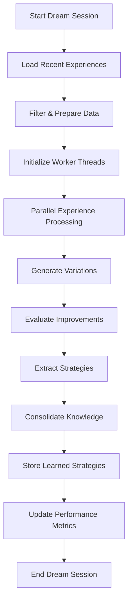

# MORPHEUS Dream Engine Architecture Design

## Overview

The Dream Engine is the core learning component of MORPHEUS that processes experiences during "dream" states to discover optimal strategies, consolidate memories, and improve system performance. It implements sophisticated experience replay with systematic variation generation and evaluation.

## Dream Engine Architecture

### Core Components

```
Dream Engine
├── Dream Orchestrator (Session Management)
├── Experience Replay Engine (Memory Processing)
├── Variation Generator (What-If Scenarios)
├── Optimization Loop (Strategy Discovery)
├── Memory Consolidation (Knowledge Integration)
└── Performance Analytics (Learning Metrics)
```

### Dream Session Lifecycle



## Detailed Component Design

### 1. Dream Orchestrator

**Purpose**: Manages dream sessions, coordinates parallel processing, and tracks performance

```python
class DreamOrchestrator:
    """
    Main coordinator for dream sessions.
    Manages parallel processing and session lifecycle.
    """
    
    def __init__(self, 
                 database: MorpheusDatabase,
                 material_bridge: MaterialBridge,
                 config: DreamConfig):
        self.db = database
        self.material_bridge = material_bridge
        self.config = config
        
        # Threading infrastructure
        self.thread_pool = ThreadPoolExecutor(max_workers=config.parallel_dreams)
        self.session_metrics = defaultdict(int)
        
        # Strategy storage
        self.discovered_strategies = []
        self.strategy_cache = {}
        
    def dream(self, duration_seconds: float = 60) -> Dict[str, Any]:
        """
        Main dream session execution.
        
        Process Flow:
        1. Load and filter experiences
        2. Distribute work across parallel threads
        3. Collect and consolidate results
        4. Store learned strategies
        5. Update performance metrics
        """
        
        start_time = time.time()
        session_id = str(uuid.uuid4())
        
        # Phase 1: Data Preparation
        experiences = self._prepare_experiences()
        
        if not experiences:
            return self._empty_session_result()
            
        # Phase 2: Parallel Processing
        worker_results = self._execute_parallel_dreams(experiences)
        
        # Phase 3: Strategy Consolidation
        consolidated_strategies = self._consolidate_strategies(worker_results)
        
        # Phase 4: Knowledge Storage
        stored_count = self._store_strategies(consolidated_strategies, session_id)
        
        # Phase 5: Performance Analysis
        session_metrics = self._analyze_session_performance(
            start_time, experiences, consolidated_strategies
        )
        
        return {
            'session_id': session_id,
            'duration': time.time() - start_time,
            'experiences_processed': len(experiences),
            'strategies_discovered': len(consolidated_strategies),
            'strategies_stored': stored_count,
            'performance_metrics': session_metrics
        }
```

### 2. Experience Replay Engine

**Purpose**: Intelligent replay of past experiences with contextual analysis

```python
class ExperienceReplayEngine:
    """
    Handles sophisticated experience replay with temporal and contextual awareness.
    """
    
    def __init__(self, config):
        self.config = config
        self.replay_buffer = PrioritizedReplayBuffer(
            capacity=config.buffer_size,
            alpha=config.prioritization_alpha
        )
        
    def replay_experience(self, experience: Dict[str, Any]) -> ReplayResult:
        """
        Replay single experience with contextual enhancement.
        """
        # Temporal context analysis
        temporal_context = self._analyze_temporal_context(experience)
        
        # Material context analysis
        material_context = self._analyze_material_context(experience)
        
        # Action context analysis
        action_context = self._analyze_action_context(experience)
        
        # Sensory context analysis
        sensory_context = self._analyze_sensory_context(experience)
        
        # Combine contexts for holistic understanding
        full_context = {
            'temporal': temporal_context,
            'material': material_context,
            'action': action_context,
            'sensory': sensory_context
        }
        
        return ReplayResult(
            experience=experience,
            context=full_context,
            replay_quality=self._assess_replay_quality(full_context),
            variation_candidates=self._identify_variation_opportunities(full_context)
        )
        
    def _analyze_temporal_context(self, experience: Dict) -> Dict:
        """Analyze temporal patterns and sequences."""
        return {
            'sequence_position': self._get_sequence_position(experience),
            'temporal_patterns': self._identify_temporal_patterns(experience),
            'causality_chains': self._trace_causality(experience),
            'timing_criticality': self._assess_timing_importance(experience)
        }
        
    def _analyze_material_context(self, experience: Dict) -> Dict:
        """Analyze material properties and interactions."""
        material = experience.get('primary_material')
        if not material:
            return {}
            
        return {
            'material_properties': self._get_material_properties(material),
            'interaction_history': self._get_material_interaction_history(material),
            'success_patterns': self._analyze_material_success_patterns(material),
            'failure_modes': self._identify_material_failure_modes(material)
        }
```

### 3. Variation Generator

**Purpose**: Generate systematic and creative variations of successful experiences

```python
class VariationGenerator:
    """
    Generates intelligent variations of experiences for strategy discovery.
    Uses multiple variation strategies for comprehensive exploration.
    """
    
    def __init__(self, config, material_bridge):
        self.config = config
        self.material_bridge = material_bridge
        
        # Variation strategies
        self.strategies = {
            'material_substitution': MaterialSubstitutionStrategy(),
            'force_modification': ForceModificationStrategy(),
            'temporal_adjustment': TemporalAdjustmentStrategy(),
            'spatial_perturbation': SpatialPerturbationStrategy(),
            'parameter_optimization': ParameterOptimizationStrategy()
        }
        
    def generate_variations(self, experience: Dict[str, Any]) -> List[ExperienceVariation]:
        """
        Generate comprehensive set of experience variations.
        """
        variations = []
        
        # Apply each variation strategy
        for strategy_name, strategy in self.strategies.items():
            try:
                strategy_variations = strategy.generate(
                    experience, 
                    self.config.variation_factor
                )
                
                # Tag variations with strategy type
                for var in strategy_variations:
                    var.strategy = strategy_name
                    var.confidence = strategy.assess_variation_quality(var)
                    
                variations.extend(strategy_variations)
                
            except Exception as e:
                logger.warning(f"Variation strategy {strategy_name} failed: {e}")
                
        # Filter and rank variations
        variations = self._filter_variations(variations)
        variations.sort(key=lambda x: x.confidence, reverse=True)
        
        return variations[:self.config.max_variations_per_experience]
        
class MaterialSubstitutionStrategy:
    """Strategy for material substitution variations."""
    
    def generate(self, experience: Dict, variation_factor: float) -> List[ExperienceVariation]:
        """Generate material substitution variations."""
        variations = []
        original_material = experience.get('primary_material')
        
        if not original_material:
            return variations
            
        # Get available materials
        available_materials = self._get_available_materials()
        
        for new_material in available_materials:
            if new_material == original_material:
                continue
                
            # Create variation
            varied_experience = experience.copy()
            varied_experience['primary_material'] = new_material
            
            # Predict sensory changes
            sensory_changes = self._predict_sensory_changes(
                original_material, new_material
            )
            
            variation = ExperienceVariation(
                original=experience,
                modified=varied_experience,
                changes={'material': {'from': original_material, 'to': new_material}},
                predicted_outcome=sensory_changes,
                variation_type='material_substitution'
            )
            
            variations.append(variation)
            
        return variations

class ForceModificationStrategy:
    """Strategy for force and pressure variations."""
    
    def generate(self, experience: Dict, variation_factor: float) -> List[ExperienceVariation]:
        """Generate force modification variations."""
        variations = []
        original_forces = experience.get('forces')
        
        if not original_forces:
            return variations
            
        # Generate force scaling factors
        scaling_factors = [0.5, 0.7, 0.8, 1.2, 1.5, 2.0]
        
        for factor in scaling_factors:
            if abs(factor - 1.0) < 0.1:  # Skip minimal changes
                continue
                
            # Scale forces
            varied_experience = experience.copy()
            varied_forces = [f * factor for f in original_forces]
            varied_experience['forces'] = varied_forces
            
            # Predict outcome changes
            outcome_prediction = self._predict_force_outcome(
                original_forces, varied_forces
            )
            
            variation = ExperienceVariation(
                original=experience,
                modified=varied_experience,
                changes={'forces': {'factor': factor}},
                predicted_outcome=outcome_prediction,
                variation_type='force_modification'
            )
            
            variations.append(variation)
            
        return variations
```

### 4. Optimization Loop

**Purpose**: Evaluate variations and discover improved strategies

```python
class OptimizationLoop:
    """
    Evaluates variations and identifies performance improvements.
    Uses sophisticated evaluation metrics and multi-objective optimization.
    """
    
    def __init__(self, config, material_bridge):
        self.config = config
        self.material_bridge = material_bridge
        
        # Evaluation metrics
        self.metrics = {
            'success_rate': SuccessRateMetric(),
            'efficiency': EfficiencyMetric(),
            'robustness': RobustnessMetric(),
            'material_compatibility': MaterialCompatibilityMetric(),
            'energy_consumption': EnergyConsumptionMetric()
        }
        
    def evaluate_variations(self, variations: List[ExperienceVariation]) -> List[EvaluationResult]:
        """
        Evaluate all variations and return ranked results.
        """
        results = []
        
        for variation in variations:
            evaluation = self._evaluate_single_variation(variation)
            
            if evaluation.improvement_score > self.config.min_improvement:
                results.append(evaluation)
                
        # Multi-objective ranking
        results = self._rank_evaluations(results)
        
        return results
        
    def _evaluate_single_variation(self, variation: ExperienceVariation) -> EvaluationResult:
        """
        Comprehensive evaluation of single variation.
        """
        scores = {}
        
        # Evaluate against each metric
        for metric_name, metric in self.metrics.items():
            try:
                score = metric.evaluate(variation)
                scores[metric_name] = score
            except Exception as e:
                logger.warning(f"Metric {metric_name} evaluation failed: {e}")
                scores[metric_name] = 0.0
                
        # Calculate weighted overall score
        overall_score = self._calculate_weighted_score(scores)
        
        # Calculate improvement over original
        improvement_score = self._calculate_improvement(variation, overall_score)
        
        return EvaluationResult(
            variation=variation,
            metric_scores=scores,
            overall_score=overall_score,
            improvement_score=improvement_score,
            confidence=self._calculate_confidence(scores),
            recommendations=self._generate_recommendations(variation, scores)
        )
        
class SuccessRateMetric:
    """Evaluates predicted success rate improvements."""
    
    def evaluate(self, variation: ExperienceVariation) -> float:
        """
        Predict success rate improvement.
        """
        original_success = variation.original.get('success', False)
        
        # Use material properties and physics to predict success
        predicted_success = self._predict_success_probability(variation.modified)
        
        if original_success:
            # Already successful, look for efficiency gains
            return min(predicted_success * 1.1, 1.0)
        else:
            # Failed originally, significant improvement if predicted to succeed
            return predicted_success * 2.0 if predicted_success > 0.7 else predicted_success

class EfficiencyMetric:
    """Evaluates resource efficiency improvements."""
    
    def evaluate(self, variation: ExperienceVariation) -> float:
        """
        Evaluate efficiency improvements.
        """
        original_forces = variation.original.get('forces', [])
        modified_forces = variation.modified.get('forces', [])
        
        if not original_forces or not modified_forces:
            return 0.0
            
        # Calculate energy efficiency
        original_energy = sum(f ** 2 for f in original_forces)
        modified_energy = sum(f ** 2 for f in modified_forces)
        
        if modified_energy == 0:
            return 0.0
            
        efficiency_ratio = original_energy / modified_energy
        
        # Reward energy reduction while maintaining success
        if efficiency_ratio > 1.0:  # Energy reduced
            return min(efficiency_ratio - 1.0, 2.0)
        else:
            return max(1.0 - efficiency_ratio, -1.0)
```

### 5. Memory Consolidation

**Purpose**: Integrate learned strategies into system knowledge

```python
class MemoryConsolidation:
    """
    Consolidates learned strategies and integrates them into system knowledge.
    """
    
    def __init__(self, database, config):
        self.db = database
        self.config = config
        self.consolidation_threshold = config.consolidation_threshold
        
    def consolidate_strategies(self, strategies: List[Strategy]) -> ConsolidationResult:
        """
        Consolidate similar strategies and integrate knowledge.
        """
        # Group similar strategies
        strategy_groups = self._group_similar_strategies(strategies)
        
        # Consolidate each group
        consolidated_strategies = []
        for group in strategy_groups:
            consolidated = self._consolidate_strategy_group(group)
            if consolidated.confidence >= self.consolidation_threshold:
                consolidated_strategies.append(consolidated)
                
        # Update system knowledge
        knowledge_updates = self._update_system_knowledge(consolidated_strategies)
        
        return ConsolidationResult(
            consolidated_strategies=consolidated_strategies,
            knowledge_updates=knowledge_updates,
            consolidation_metrics=self._calculate_consolidation_metrics(strategies, consolidated_strategies)
        )
        
    def _group_similar_strategies(self, strategies: List[Strategy]) -> List[List[Strategy]]:
        """
        Group similar strategies using clustering.
        """
        if len(strategies) <= 1:
            return [strategies]
            
        # Extract strategy features for clustering
        strategy_features = []
        for strategy in strategies:
            features = self._extract_strategy_features(strategy)
            strategy_features.append(features)
            
        # Perform clustering
        from sklearn.cluster import AgglomerativeClustering
        
        clustering = AgglomerativeClustering(
            n_clusters=None,
            distance_threshold=0.3,
            linkage='ward'
        )
        
        cluster_labels = clustering.fit_predict(strategy_features)
        
        # Group strategies by cluster
        groups = {}
        for strategy, label in zip(strategies, cluster_labels):
            if label not in groups:
                groups[label] = []
            groups[label].append(strategy)
            
        return list(groups.values())
        
    def _consolidate_strategy_group(self, group: List[Strategy]) -> Strategy:
        """
        Consolidate a group of similar strategies into one.
        """
        if len(group) == 1:
            return group[0]
            
        # Take best performing strategy as base
        best_strategy = max(group, key=lambda s: s.improvement_score)
        
        # Merge applicable materials and scenarios
        all_materials = set()
        all_scenarios = set()
        total_confidence = 0
        
        for strategy in group:
            all_materials.update(strategy.applicable_materials)
            all_scenarios.update(strategy.applicable_scenarios)
            total_confidence += strategy.confidence
            
        # Create consolidated strategy
        consolidated = Strategy(
            name=f"consolidated_{best_strategy.name}",
            category=best_strategy.category,
            strategy_data=self._merge_strategy_data(group),
            improvement_score=max(s.improvement_score for s in group),
            confidence=total_confidence / len(group),
            applicable_materials=list(all_materials),
            applicable_scenarios=list(all_scenarios),
            consolidation_count=len(group)
        )
        
        return consolidated
```

## Performance Characteristics

### Computational Complexity

- **Experience Loading**: O(n log n) where n = number of experiences
- **Variation Generation**: O(n × m) where m = variations per experience  
- **Evaluation**: O(n × m × k) where k = number of metrics
- **Consolidation**: O(s²) where s = number of strategies

### Memory Requirements

- **Experience Buffer**: ~1MB per 1000 experiences
- **Variation Storage**: ~500KB per variation batch
- **Strategy Cache**: ~100KB per learned strategy
- **Working Memory**: ~50MB during active dream session

### Scalability Metrics

| Metric | Performance Target |
|--------|-------------------|
| Dreams per hour | 10-60 sessions |
| Experiences per dream | 1,000-10,000 |
| Variations per experience | 5-20 variations |
| Strategy discovery rate | 1-10 strategies per dream |
| Memory consolidation time | < 30 seconds |

## Dream Session Types

### 1. Exploration Dreams
- **Purpose**: Discover new strategies in unfamiliar scenarios
- **Characteristics**: High variation factor, broad material coverage
- **Frequency**: When encountering new materials or tasks

### 2. Optimization Dreams  
- **Purpose**: Refine existing strategies for better performance
- **Characteristics**: Focused variations, performance-oriented metrics
- **Frequency**: After sufficient experience with known scenarios

### 3. Consolidation Dreams
- **Purpose**: Integrate and compress learned knowledge
- **Characteristics**: Strategy merging, knowledge graph updates
- **Frequency**: Periodic maintenance sessions

### 4. Diagnostic Dreams
- **Purpose**: Analyze failure modes and error patterns
- **Characteristics**: Focus on failed experiences, root cause analysis
- **Frequency**: When success rates decline

## Integration with MORPHEUS System

### Data Flow Integration
```
Perception System → Experience Storage → Dream Engine → Strategy Storage → Improved Behavior
```

### Configuration Integration
```yaml
dream:
  exploration_dreams:
    frequency: "on_new_material"
    variation_factor: 0.3
    duration_seconds: 120
    
  optimization_dreams:
    frequency: "daily"
    variation_factor: 0.1
    duration_seconds: 60
    
  consolidation_dreams:
    frequency: "weekly"
    consolidation_threshold: 0.8
    duration_seconds: 300
```

### Performance Monitoring
- Strategy discovery rates
- Improvement ratios over time
- Memory usage and cleanup efficiency
- Dream session success rates

This Dream Engine design provides MORPHEUS with sophisticated learning capabilities that go beyond simple experience replay, enabling true autonomous improvement through systematic exploration and knowledge consolidation.