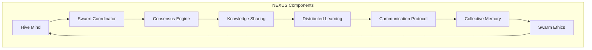
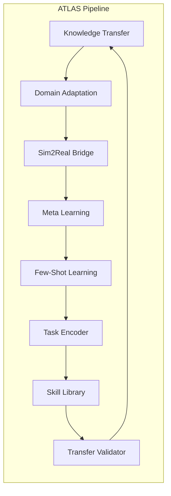
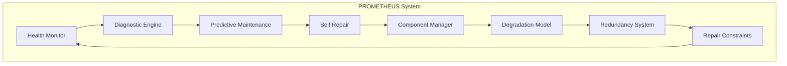
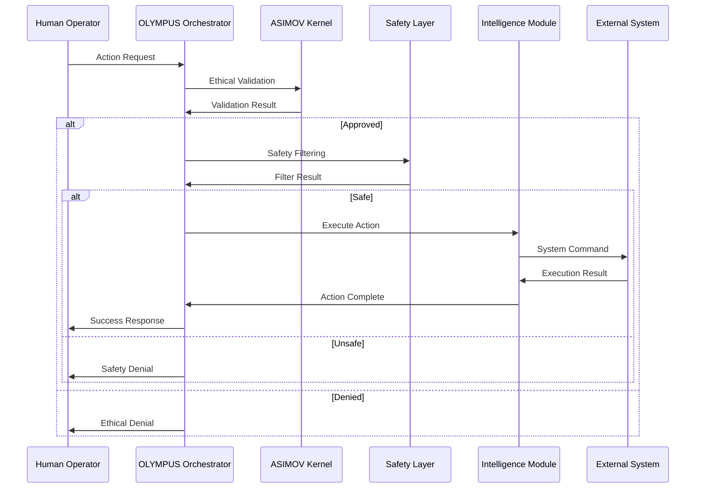
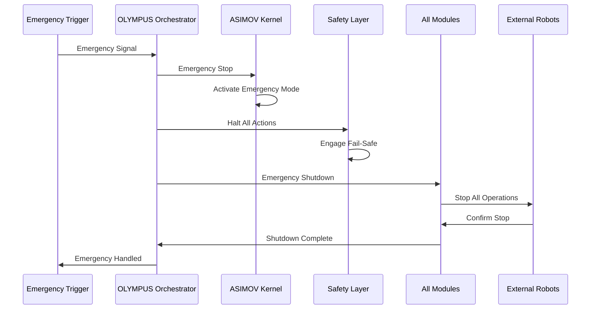

# OLYMPUS System Architecture

## Overview

Project OLYMPUS implements a sophisticated multi-layered architecture designed for safe, ethical, and intelligent autonomous operations. The system follows a modular design with strict separation of concerns, comprehensive safety validation, and ethical oversight at every level.

## Core Principles

### 1. **Safety-First Design**
- Every component validates actions through the ethical framework
- Multi-layer safety filtering prevents harmful operations
- Emergency shutdown capabilities at all levels
- Human override authority is absolute and immediate

### 2. **Modular Architecture**
- Loosely coupled components with well-defined interfaces
- Plugin-based extension system for new capabilities
- Independent module testing and validation
- Graceful degradation when components fail

### 3. **Transparency & Auditability**
- Complete audit trails for all operations
- Explainable decision-making processes
- Real-time monitoring and logging
- Human-readable system status and diagnostics

## System Layers

### Layer 1: Core Infrastructure

#### OLYMPUS Orchestrator
```python
class OlympusOrchestrator:
    """
    Central nervous system coordinating all operations
    - Routes all actions through ethical validation
    - Manages module lifecycle and dependencies
    - Handles emergency situations and human overrides
    - Maintains comprehensive audit trails
    """
```

**Key Responsibilities:**
- System initialization and coordination
- Action request processing and validation
- Module management and health monitoring
- Emergency response and graceful shutdown

**Components:**
- `ConfigurationManager`: System configuration and settings
- `IdentityManager`: System identity and authentication
- `ConsciousnessKernel`: Self-awareness and introspection
- `SystemHealth`: Health monitoring and diagnostics

### Layer 2: Ethical Framework

#### ASIMOV Kernel
```python
class AsimovKernel:
    """
    Immutable ethical foundation implementing Asimov's Laws
    - Cryptographically protected law storage
    - Real-time integrity verification (100ms intervals)
    - Comprehensive ethical evaluation of all actions
    - Emergency override and human authority systems
    """
```

**Implementation Details:**
- **Immutable Laws**: Stored with SHA-256 checksums
- **Integrity Monitoring**: Continuous verification thread
- **Evaluation Engine**: Multi-criteria ethical assessment
- **Audit System**: Complete decision logging

**Laws Hierarchy:**
1. **First Law**: Human safety (absolute priority)
2. **Second Law**: Human obedience (except First Law conflicts)
3. **Third Law**: Self-preservation (lowest priority)

### Layer 3: Safety Systems

#### Multi-Layer Action Filter
```python
class ActionFilter:
    """
    Five-layer safety filtering system:
    1. Physics validation (force, speed, acceleration limits)
    2. Spatial validation (boundaries, collision avoidance)
    3. Intention validation (purpose and safety analysis)
    4. Context validation (environment and system status)
    5. Human safety validation (proximity and interaction)
    """
```

**Filter Layers:**

1. **Physics Filter**
   - Force limits: 20N maximum
   - Speed limits: 1.0 m/s maximum
   - Acceleration limits: 2.0 m/s² maximum
   - Automatic scaling in permissive mode

2. **Spatial Filter**
   - Workspace boundary enforcement
   - Obstacle collision avoidance
   - Reach distance limitations
   - Trajectory safety validation

3. **Intention Filter**
   - High-risk operation detection
   - Dangerous tool usage validation
   - Repetitive motion analysis
   - Human confirmation requirements

4. **Context Filter**
   - Environmental condition assessment
   - System health validation
   - Sensor operational status
   - Battery and error state checking

5. **Human Safety Filter**
   - Human presence detection
   - Safe distance enforcement
   - Warning zone management
   - Direct interaction validation

### Layer 4: Intelligence Modules

#### NEXUS - Collective Intelligence


**Capabilities:**
- **Collective Decision Making**: Democratic consensus building
- **Knowledge Distribution**: Experience sharing across units
- **Swarm Coordination**: Multi-robot task execution
- **Ethical Validation**: Collective behavior assessment

#### ATLAS - Transfer Learning


**Features:**
- **Cross-Domain Transfer**: Safe knowledge adaptation
- **Reality Gap Bridging**: Simulation to real-world transfer
- **Rapid Learning**: Few-shot adaptation capabilities
- **Skill Management**: Reusable capability library

#### PROMETHEUS - Self-Healing


**Capabilities:**
- **Predictive Maintenance**: ML-driven failure prediction
- **Autonomous Repair**: Safe self-correction capabilities
- **Health Monitoring**: Continuous system vitals tracking
- **Redundancy Management**: Automatic failover systems

### Layer 5: External Integration

#### GASM Integration
```python
class GASMBridge:
    """
    Integration bridge to GASM robotics platform
    - Spatial agent coordination
    - Physics simulation interface
    - Sensor data processing
    - Actuator command translation
    """
```

#### Morpheus Integration
```python
class MorpheusBridge:
    """
    Integration with Morpheus dream simulation system
    - Counterfactual reasoning
    - Scenario planning and validation
    - Risk assessment through simulation
    - Learning from imagined experiences
    """
```

## Data Flow Architecture

### Action Processing Pipeline



### Emergency Response Flow



## Component Interfaces

### Core Module Interface

```python
from abc import ABC, abstractmethod
from typing import Dict, Any, Optional

class OlympusModule(ABC):
    """
    Base interface for all OLYMPUS modules
    Ensures consistent integration and safety validation
    """
    
    @abstractmethod
    async def initialize(self) -> bool:
        """Initialize the module with safety validation"""
        pass
    
    @abstractmethod
    async def execute_action(self, action: str, parameters: Dict[str, Any]) -> Any:
        """Execute action with ethical validation"""
        pass
    
    @abstractmethod
    async def get_status(self) -> Dict[str, Any]:
        """Get current module status and health"""
        pass
    
    @abstractmethod
    async def shutdown(self) -> bool:
        """Gracefully shutdown the module"""
        pass
    
    @abstractmethod
    async def emergency_stop(self) -> bool:
        """Immediate emergency shutdown"""
        pass
```

### Safety Validation Interface

```python
class SafetyValidator(ABC):
    """
    Interface for safety validation components
    All validators must implement consistent safety checks
    """
    
    @abstractmethod
    async def validate_action(self, action: Dict[str, Any]) -> ValidationResult:
        """Validate action for safety compliance"""
        pass
    
    @abstractmethod
    async def get_safety_status(self) -> Dict[str, Any]:
        """Get current safety system status"""
        pass
```

## Security Architecture

### Cryptographic Protection

- **Law Integrity**: HMAC-SHA256 protection of ethical laws
- **Communication**: End-to-end encrypted module communication
- **Audit Trails**: Cryptographically signed audit logs
- **Access Control**: Multi-factor authentication for operators

### Threat Model

**Protected Against:**
- Code injection attacks
- Law tampering attempts
- Unauthorized access
- Data corruption
- Network interception

**Security Measures:**
- Input validation and sanitization
- Cryptographic integrity verification
- Access control and authentication
- Secure communication protocols
- Regular security audits

## Performance Characteristics

### Response Times
- **Emergency Stop**: <1ms
- **Ethical Validation**: <5ms
- **Safety Filtering**: <10ms
- **Action Execution**: <100ms
- **Status Queries**: <50ms

### Scalability
- **Maximum Robots**: 100 units per NEXUS swarm
- **Concurrent Actions**: 1000 per second
- **Memory Usage**: <2GB base system
- **Storage Growth**: ~10MB per hour of operation

### Reliability
- **Uptime Target**: 99.9%
- **MTBF**: >8760 hours (1 year)
- **Recovery Time**: <30 seconds
- **Data Loss**: Zero tolerance

## Configuration Management

### Environment Configuration
```yaml
# config/production.yaml
olympus:
  orchestrator:
    max_concurrent_actions: 1000
    emergency_timeout_ms: 1000
    audit_retention_days: 365
    
  asimov:
    integrity_check_interval_ms: 100
    law_validation_strict: true
    human_override_enabled: true
    
  safety:
    strict_mode: true
    physics_limits:
      max_force: 20.0
      max_speed: 1.0
      max_acceleration: 2.0
    
  modules:
    nexus:
      max_swarm_size: 100
      consensus_threshold: 0.67
    atlas:
      transfer_validation_level: "high"
    prometheus:
      health_check_interval_s: 5
      predictive_horizon_hours: 24
```

## Monitoring & Observability

### Metrics Collection
- **System Health**: CPU, memory, disk usage
- **Action Metrics**: Success rate, response times
- **Safety Events**: Filter triggers, emergency stops
- **Ethical Decisions**: Law applications, overrides

### Alerting
- **Critical**: Emergency stops, safety violations
- **High**: Ethical concerns, system degradation
- **Medium**: Performance issues, configuration changes
- **Low**: Routine events, informational

### Dashboards
- **System Overview**: High-level status and health
- **Safety Monitoring**: Real-time safety system status
- **Ethical Dashboard**: Ethical decision tracking
- **Performance Metrics**: System performance analysis

## Deployment Patterns

### Development Environment
- Local simulation with mock robots
- Safety systems in permissive mode
- Comprehensive logging and debugging
- Rapid iteration and testing

### Staging Environment
- Production-like configuration
- Full safety system activation
- End-to-end integration testing
- Performance and load testing

### Production Environment
- Maximum security and safety settings
- Redundant systems and failover
- Comprehensive monitoring and alerting
- Regular backup and disaster recovery

## Future Architecture Evolution

### Planned Enhancements
- **Quantum-Safe Cryptography**: Post-quantum security
- **Advanced Consciousness**: Enhanced self-awareness
- **Neural Architecture Search**: Adaptive intelligence
- **Blockchain Auditing**: Immutable audit trails

### Research Directions
- **Emergent Behavior**: Complex system dynamics
- **Ethical Evolution**: Adaptive moral frameworks
- **Hybrid Intelligence**: Human-AI collaboration
- **Distributed Consciousness**: Multi-node awareness

---

**Note**: This architecture is designed for maximum safety and ethical compliance. Any modifications must undergo rigorous safety review and ethical validation before implementation.