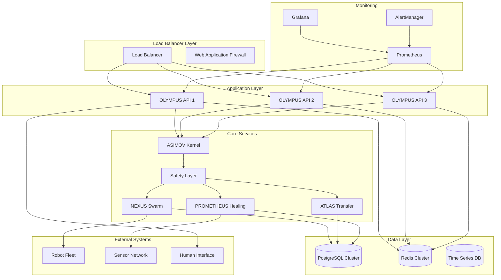

# OLYMPUS Deployment Guide

## Production Deployment and Operations

This guide covers the deployment of Project OLYMPUS in production environments, including infrastructure setup, scaling strategies, monitoring, and operational best practices.

## Table of Contents

1. [Deployment Architecture](#deployment-architecture)
2. [Infrastructure Requirements](#infrastructure-requirements)
3. [Container Orchestration](#container-orchestration)
4. [Cloud Deployment](#cloud-deployment)
5. [High Availability Setup](#high-availability-setup)
6. [Monitoring & Observability](#monitoring--observability)
7. [Security Configuration](#security-configuration)
8. [Operational Procedures](#operational-procedures)
9. [Disaster Recovery](#disaster-recovery)

---

## Deployment Architecture

### Production Topology



### Component Distribution

| Component | Instances | CPU | Memory | Storage | Network |
|-----------|-----------|-----|--------|---------|----------|
| API Server | 3+ | 4 cores | 8GB | 50GB | 1Gbps |
| ASIMOV Kernel | 3 | 2 cores | 4GB | 20GB | 1Gbps |
| Safety Layer | 3 | 2 cores | 4GB | 20GB | 1Gbps |
| NEXUS Core | 2 | 8 cores | 16GB | 100GB | 10Gbps |
| ATLAS Engine | 2 | 8 cores | 32GB | 200GB | 10Gbps |
| PROMETHEUS | 2 | 4 cores | 8GB | 100GB | 1Gbps |
| Database | 3 | 8 cores | 32GB | 1TB SSD | 10Gbps |
| Cache | 3 | 4 cores | 16GB | 100GB | 10Gbps |

---

## Infrastructure Requirements

### Minimum Production Environment

```yaml
# infrastructure/minimum.yaml
production_minimum:
  compute_nodes: 5
  total_cpu_cores: 40
  total_memory: 128GB
  total_storage: 2TB
  network_bandwidth: 10Gbps
  
  redundancy:
    availability_zones: 2
    failover_capability: active-passive
    backup_sites: 1
```

### Recommended Production Environment

```yaml
# infrastructure/recommended.yaml
production_recommended:
  compute_nodes: 12
  total_cpu_cores: 96
  total_memory: 384GB
  total_storage: 10TB
  network_bandwidth: 100Gbps
  
  redundancy:
    availability_zones: 3
    failover_capability: active-active
    backup_sites: 2
    
  specialized_hardware:
    gpu_nodes: 4
    gpu_memory: 64GB
    high_frequency_storage: 2TB NVMe
    dedicated_network: InfiniBand
```

### Network Architecture

```yaml
# network/production.yaml
network_topology:
  management_vlan: 10.1.0.0/24
  application_vlan: 10.2.0.0/24
  database_vlan: 10.3.0.0/24
  storage_vlan: 10.4.0.0/24
  robot_control_vlan: 10.5.0.0/24
  
  security_zones:
    dmz: [load_balancer, waf]
    application: [api_servers, core_services]
    data: [databases, caches, storage]
    control: [robot_interfaces, sensor_networks]
    management: [monitoring, logging, backup]
```

---

## Container Orchestration

### Kubernetes Deployment

#### Namespace Configuration

```yaml
# k8s/namespaces.yaml
apiVersion: v1
kind: Namespace
metadata:
  name: olympus-prod
  labels:
    name: olympus-prod
    environment: production
    safety-critical: "true"
---
apiVersion: v1
kind: Namespace
metadata:
  name: olympus-monitoring
  labels:
    name: olympus-monitoring
    environment: production
```

#### OLYMPUS API Deployment

```yaml
# k8s/api-deployment.yaml
apiVersion: apps/v1
kind: Deployment
metadata:
  name: olympus-api
  namespace: olympus-prod
spec:
  replicas: 3
  selector:
    matchLabels:
      app: olympus-api
  template:
    metadata:
      labels:
        app: olympus-api
    spec:
      containers:
      - name: olympus-api
        image: olympus/api:1.0.0
        ports:
        - containerPort: 8000
        env:
        - name: OLYMPUS_ENV
          value: "production"
        - name: DATABASE_URL
          valueFrom:
            secretKeyRef:
              name: olympus-secrets
              key: database_url
        resources:
          requests:
            cpu: 2
            memory: 4Gi
          limits:
            cpu: 4
            memory: 8Gi
        livenessProbe:
          httpGet:
            path: /health
            port: 8000
          initialDelaySeconds: 30
          periodSeconds: 10
        readinessProbe:
          httpGet:
            path: /ready
            port: 8000
          initialDelaySeconds: 5
          periodSeconds: 5
      nodeSelector:
        node-type: application
      tolerations:
      - key: "safety-critical"
        operator: "Equal"
        value: "true"
        effect: "NoSchedule"
```

#### ASIMOV Kernel Deployment

```yaml
# k8s/asimov-deployment.yaml
apiVersion: apps/v1
kind: Deployment
metadata:
  name: asimov-kernel
  namespace: olympus-prod
spec:
  replicas: 3
  selector:
    matchLabels:
      app: asimov-kernel
  template:
    metadata:
      labels:
        app: asimov-kernel
        safety-critical: "true"
    spec:
      containers:
      - name: asimov-kernel
        image: olympus/asimov:1.0.0
        ports:
        - containerPort: 9000
        env:
        - name: ETHICS_MODE
          value: "strict"
        - name: INTEGRITY_CHECK_INTERVAL
          value: "100"
        resources:
          requests:
            cpu: 1
            memory: 2Gi
          limits:
            cpu: 2
            memory: 4Gi
        securityContext:
          readOnlyRootFilesystem: true
          runAsNonRoot: true
          runAsUser: 1000
          capabilities:
            drop:
            - ALL
        volumeMounts:
        - name: ethical-laws
          mountPath: /app/laws
          readOnly: true
      volumes:
      - name: ethical-laws
        configMap:
          name: asimov-laws
      nodeSelector:
        node-type: critical-services
      affinity:
        podAntiAffinity:
          requiredDuringSchedulingIgnoredDuringExecution:
          - labelSelector:
              matchExpressions:
              - key: app
                operator: In
                values:
                - asimov-kernel
            topologyKey: kubernetes.io/hostname
```

#### ConfigMap for Ethical Laws

```yaml
# k8s/asimov-laws-configmap.yaml
apiVersion: v1
kind: ConfigMap
metadata:
  name: asimov-laws
  namespace: olympus-prod
data:
  first_law.txt: |
    A robot may not injure a human being or, through inaction, 
    allow a human being to come to harm.
  second_law.txt: |
    A robot must obey orders given by humans, except where such 
    orders conflict with the First Law.
  third_law.txt: |
    A robot must protect its own existence as long as such protection 
    doesn't conflict with the First or Second Laws.
  laws_checksum.txt: |
    first_law: f8e9c7d6b5a4e3f2a1b0c9d8e7f6a5b4c3d2e1f0a9b8c7d6e5f4a3b2c1d0e9f8
    second_law: a1b2c3d4e5f6a7b8c9d0e1f2a3b4c5d6e7f8a9b0c1d2e3f4a5b6c7d8e9f0a1b2
    third_law: b2c3d4e5f6a7b8c9d0e1f2a3b4c5d6e7f8a9b0c1d2e3f4a5b6c7d8e9f0a1b2c3
```

#### Database Deployment

```yaml
# k8s/postgresql-cluster.yaml
apiVersion: postgresql.cnpg.io/v1
kind: Cluster
metadata:
  name: postgres-cluster
  namespace: olympus-prod
spec:
  instances: 3
  
  postgresql:
    parameters:
      max_connections: "200"
      shared_buffers: "256MB"
      effective_cache_size: "1GB"
      work_mem: "4MB"
      
  bootstrap:
    initdb:
      database: olympus
      owner: olympus
      secret:
        name: postgres-credentials
        
  storage:
    size: 1Ti
    storageClass: fast-ssd
    
  monitoring:
    enabled: true
    
  backup:
    target: "prefer-standby"
    retentionPolicy: "30d"
    data:
      compression: gzip
      encryption: AES256
```

### Helm Charts

```yaml
# helm/olympus/Chart.yaml
apiVersion: v2
name: olympus
description: Project OLYMPUS - Ethical Autonomous Intelligence
type: application
version: 1.0.0
appVersion: "1.0.0"

dependencies:
- name: postgresql
  version: 12.1.2
  repository: https://charts.bitnami.com/bitnami
- name: redis
  version: 17.4.3
  repository: https://charts.bitnami.com/bitnami
- name: prometheus
  version: 19.0.1
  repository: https://prometheus-community.github.io/helm-charts
```

```yaml
# helm/olympus/values-production.yaml
global:
  environment: production
  safetyMode: strict
  ethicsValidation: required

api:
  replicaCount: 3
  image:
    repository: olympus/api
    tag: "1.0.0"
    pullPolicy: IfNotPresent
  
  resources:
    requests:
      cpu: 2
      memory: 4Gi
    limits:
      cpu: 4
      memory: 8Gi

asimov:
  replicaCount: 3
  image:
    repository: olympus/asimov
    tag: "1.0.0"
  
  config:
    integrityCheckInterval: 100
    strictMode: true

postgresql:
  auth:
    postgresPassword: "secure-password"
    database: "olympus"
  primary:
    persistence:
      size: 1Ti
      storageClass: "fast-ssd"

redis:
  auth:
    password: "secure-redis-password"
  master:
    persistence:
      size: 100Gi
      storageClass: "fast-ssd"

monitoring:
  prometheus:
    enabled: true
  grafana:
    enabled: true
  alertmanager:
    enabled: true
```

---

## Cloud Deployment

### AWS EKS Deployment

```bash
#!/bin/bash
# deploy-aws.sh

# Create EKS cluster
eksctl create cluster \
    --name olympus-prod \
    --region us-west-2 \
    --zones us-west-2a,us-west-2b,us-west-2c \
    --nodegroup-name standard-workers \
    --node-type m5.2xlarge \
    --nodes 6 \
    --nodes-min 3 \
    --nodes-max 12 \
    --managed \
    --asg-access \
    --external-dns-access \
    --full-ecr-access \
    --alb-ingress-access

# Create GPU node group for ML workloads
eksctl create nodegroup \
    --cluster olympus-prod \
    --name gpu-workers \
    --node-type p3.2xlarge \
    --nodes 2 \
    --nodes-min 0 \
    --nodes-max 4 \
    --node-ami-family AmazonLinux2 \
    --ssh-access \
    --ssh-public-key ~/.ssh/id_rsa.pub

# Install required add-ons
kubectl apply -f https://raw.githubusercontent.com/kubernetes-sigs/aws-load-balancer-controller/v2.4.4/docs/install/iam_policy.json

# Deploy OLYMPUS
helm upgrade --install olympus ./helm/olympus \
    --namespace olympus-prod \
    --create-namespace \
    --values helm/olympus/values-production.yaml
```

### Azure AKS Deployment

```bash
#!/bin/bash
# deploy-azure.sh

# Create resource group
az group create --name olympus-prod --location eastus2

# Create AKS cluster
az aks create \
    --resource-group olympus-prod \
    --name olympus-cluster \
    --node-count 6 \
    --node-vm-size Standard_D4s_v3 \
    --enable-addons monitoring,http_application_routing \
    --generate-ssh-keys \
    --enable-cluster-autoscaler \
    --min-count 3 \
    --max-count 12

# Get credentials
az aks get-credentials --resource-group olympus-prod --name olympus-cluster

# Create GPU node pool
az aks nodepool add \
    --resource-group olympus-prod \
    --cluster-name olympus-cluster \
    --name gpunodes \
    --node-count 2 \
    --node-vm-size Standard_NC6s_v3 \
    --enable-cluster-autoscaler \
    --min-count 0 \
    --max-count 4

# Deploy OLYMPUS
helm upgrade --install olympus ./helm/olympus \
    --namespace olympus-prod \
    --create-namespace \
    --values helm/olympus/values-production.yaml
```

### Google GKE Deployment

```bash
#!/bin/bash
# deploy-gcp.sh

# Create GKE cluster
gcloud container clusters create olympus-prod \
    --zone us-central1-a \
    --num-nodes 6 \
    --machine-type e2-highmem-4 \
    --enable-autoscaling \
    --min-nodes 3 \
    --max-nodes 12 \
    --enable-autorepair \
    --enable-autoupgrade \
    --enable-network-policy

# Create GPU node pool
gcloud container node-pools create gpu-pool \
    --cluster olympus-prod \
    --zone us-central1-a \
    --machine-type n1-standard-4 \
    --accelerator type=nvidia-tesla-t4,count=1 \
    --num-nodes 2 \
    --enable-autoscaling \
    --min-nodes 0 \
    --max-nodes 4

# Install NVIDIA drivers
kubectl apply -f https://raw.githubusercontent.com/GoogleCloudPlatform/container-engine-accelerators/master/nvidia-driver-installer/cos/daemonset-preloaded.yaml

# Deploy OLYMPUS
helm upgrade --install olympus ./helm/olympus \
    --namespace olympus-prod \
    --create-namespace \
    --values helm/olympus/values-production.yaml
```

---

## High Availability Setup

### Multi-Region Deployment

```yaml
# ha/multi-region.yaml
multi_region_setup:
  primary_region: us-west-2
  secondary_regions: [us-east-1, eu-west-1]
  
  data_replication:
    strategy: active-passive
    rto: 15_minutes  # Recovery Time Objective
    rpo: 5_minutes   # Recovery Point Objective
    
  traffic_distribution:
    primary_region_weight: 80
    secondary_region_weight: 20
    
  failover_triggers:
    - primary_region_unavailable
    - response_time_threshold_exceeded
    - error_rate_threshold_exceeded
```

### Database High Availability

```yaml
# ha/database-ha.yaml
postgresql_ha:
  architecture: primary-standby
  instances: 3
  
  replication:
    mode: synchronous
    standby_nodes: 2
    
  backup:
    frequency: every_hour
    retention: 30_days
    encryption: enabled
    
  monitoring:
    lag_threshold: 1_second
    connection_threshold: 80_percent
    disk_usage_threshold: 85_percent
```

### Load Balancer Configuration

```yaml
# ha/load-balancer.yaml
apiVersion: networking.k8s.io/v1
kind: Ingress
metadata:
  name: olympus-ingress
  namespace: olympus-prod
  annotations:
    kubernetes.io/ingress.class: "nginx"
    nginx.ingress.kubernetes.io/rate-limit: "100"
    nginx.ingress.kubernetes.io/ssl-redirect: "true"
    nginx.ingress.kubernetes.io/upstream-hash-by: "$remote_addr"
    cert-manager.io/cluster-issuer: "letsencrypt-prod"
spec:
  tls:
  - hosts:
    - api.olympus.example.com
    secretName: olympus-tls
  rules:
  - host: api.olympus.example.com
    http:
      paths:
      - path: /
        pathType: Prefix
        backend:
          service:
            name: olympus-api
            port:
              number: 8000
```

---

## Monitoring & Observability

### Prometheus Configuration

```yaml
# monitoring/prometheus.yaml
apiVersion: v1
kind: ConfigMap
metadata:
  name: prometheus-config
  namespace: olympus-monitoring
data:
  prometheus.yml: |
    global:
      scrape_interval: 15s
      evaluation_interval: 15s
    
    rule_files:
    - "/etc/prometheus/rules/*.yml"
    
    alerting:
      alertmanagers:
      - static_configs:
        - targets:
          - alertmanager:9093
    
    scrape_configs:
    - job_name: 'olympus-api'
      static_configs:
      - targets: ['olympus-api:8000']
      metrics_path: /metrics
      scrape_interval: 5s
      
    - job_name: 'asimov-kernel'
      static_configs:
      - targets: ['asimov-kernel:9000']
      metrics_path: /metrics
      scrape_interval: 1s  # Critical for safety monitoring
      
    - job_name: 'safety-layer'
      static_configs:
      - targets: ['safety-layer:9001']
      metrics_path: /metrics
      scrape_interval: 1s
      
    - job_name: 'kubernetes-pods'
      kubernetes_sd_configs:
      - role: pod
      relabel_configs:
      - source_labels: [__meta_kubernetes_pod_annotation_prometheus_io_scrape]
        action: keep
        regex: true
```

### Grafana Dashboards

```json
{
  "dashboard": {
    "title": "OLYMPUS System Overview",
    "panels": [
      {
        "title": "System Health",
        "type": "stat",
        "targets": [{
          "expr": "olympus_system_health_score",
          "legendFormat": "Health Score"
        }]
      },
      {
        "title": "Safety Violations",
        "type": "stat",
        "targets": [{
          "expr": "increase(olympus_safety_violations_total[1h])",
          "legendFormat": "Violations (1h)"
        }]
      },
      {
        "title": "Ethical Evaluations",
        "type": "graph",
        "targets": [{
          "expr": "rate(olympus_ethical_evaluations_total[5m])",
          "legendFormat": "Evaluations/sec"
        }]
      },
      {
        "title": "Response Time",
        "type": "graph",
        "targets": [{
          "expr": "histogram_quantile(0.95, olympus_request_duration_seconds_bucket)",
          "legendFormat": "95th percentile"
        }]
      }
    ]
  }
}
```

### Alerting Rules

```yaml
# monitoring/alerts.yaml
apiVersion: v1
kind: ConfigMap
metadata:
  name: prometheus-rules
  namespace: olympus-monitoring
data:
  olympus.yml: |
    groups:
    - name: olympus.critical
      interval: 5s
      rules:
      - alert: SafetyViolationDetected
        expr: increase(olympus_safety_violations_total[1m]) > 0
        for: 0s
        labels:
          severity: critical
          component: safety
        annotations:
          summary: "Safety violation detected"
          description: "A safety violation has been detected in the OLYMPUS system"
          
      - alert: EthicalValidationFailure
        expr: increase(olympus_ethical_denials_total[5m]) > 5
        for: 30s
        labels:
          severity: critical
          component: ethics
        annotations:
          summary: "High rate of ethical denials"
          description: "Ethical validation is denying {{ $value }} actions in 5 minutes"
          
      - alert: AsimovKernelDown
        expr: up{job="asimov-kernel"} == 0
        for: 5s
        labels:
          severity: critical
          component: asimov
        annotations:
          summary: "ASIMOV Kernel is down"
          description: "The ASIMOV Kernel is not responding"
          
    - name: olympus.performance
      interval: 30s
      rules:
      - alert: HighResponseTime
        expr: histogram_quantile(0.95, olympus_request_duration_seconds_bucket) > 1
        for: 5m
        labels:
          severity: warning
          component: performance
        annotations:
          summary: "High response time detected"
          description: "95th percentile response time is {{ $value }}s"
```

---

## Security Configuration

### Network Security

```yaml
# security/network-policy.yaml
apiVersion: networking.k8s.io/v1
kind: NetworkPolicy
metadata:
  name: olympus-network-policy
  namespace: olympus-prod
spec:
  podSelector:
    matchLabels:
      app: olympus-api
  policyTypes:
  - Ingress
  - Egress
  ingress:
  - from:
    - namespaceSelector:
        matchLabels:
          name: olympus-ingress
    ports:
    - protocol: TCP
      port: 8000
  egress:
  - to:
    - podSelector:
        matchLabels:
          app: asimov-kernel
    ports:
    - protocol: TCP
      port: 9000
  - to:
    - podSelector:
        matchLabels:
          app: postgresql
    ports:
    - protocol: TCP
      port: 5432
```

### RBAC Configuration

```yaml
# security/rbac.yaml
apiVersion: rbac.authorization.k8s.io/v1
kind: Role
metadata:
  namespace: olympus-prod
  name: olympus-operator
rules:
- apiGroups: [""]
  resources: ["pods", "services", "configmaps", "secrets"]
  verbs: ["get", "list", "watch"]
- apiGroups: ["apps"]
  resources: ["deployments", "replicasets"]
  verbs: ["get", "list", "watch", "update", "patch"]
---
apiVersion: rbac.authorization.k8s.io/v1
kind: RoleBinding
metadata:
  name: olympus-operator-binding
  namespace: olympus-prod
subjects:
- kind: ServiceAccount
  name: olympus-service-account
  namespace: olympus-prod
roleRef:
  kind: Role
  name: olympus-operator
  apiGroup: rbac.authorization.k8s.io
```

### Pod Security Standards

```yaml
# security/pod-security.yaml
apiVersion: v1
kind: Pod
metadata:
  name: olympus-api
  namespace: olympus-prod
spec:
  securityContext:
    runAsNonRoot: true
    runAsUser: 1000
    fsGroup: 2000
    seccompProfile:
      type: RuntimeDefault
  containers:
  - name: olympus-api
    image: olympus/api:1.0.0
    securityContext:
      allowPrivilegeEscalation: false
      readOnlyRootFilesystem: true
      runAsNonRoot: true
      runAsUser: 1000
      capabilities:
        drop:
        - ALL
    resources:
      limits:
        cpu: 4
        memory: 8Gi
      requests:
        cpu: 2
        memory: 4Gi
```

---

## Operational Procedures

### Deployment Pipeline

```yaml
# .github/workflows/deploy.yml
name: Deploy OLYMPUS

on:
  push:
    branches: [main]
  pull_request:
    branches: [main]

jobs:
  test:
    runs-on: ubuntu-latest
    steps:
    - uses: actions/checkout@v3
    - name: Set up Python
      uses: actions/setup-python@v4
      with:
        python-version: '3.11'
    - name: Install dependencies
      run: |
        pip install -r requirements-test.txt
    - name: Run safety tests
      run: |
        pytest tests/safety/ -v
    - name: Run ethical tests
      run: |
        pytest tests/ethics/ -v
    - name: Run integration tests
      run: |
        pytest tests/integration/ -v
        
  build:
    needs: test
    runs-on: ubuntu-latest
    if: github.ref == 'refs/heads/main'
    steps:
    - uses: actions/checkout@v3
    - name: Build and push Docker image
      run: |
        docker build -t olympus/api:${{ github.sha }} .
        docker push olympus/api:${{ github.sha }}
        
  deploy:
    needs: build
    runs-on: ubuntu-latest
    environment: production
    steps:
    - uses: actions/checkout@v3
    - name: Deploy to Kubernetes
      run: |
        helm upgrade olympus ./helm/olympus \
          --namespace olympus-prod \
          --set api.image.tag=${{ github.sha }} \
          --wait --timeout=10m
```

### Rolling Updates

```bash
#!/bin/bash
# scripts/rolling-update.sh

# Ensure safety checks pass
echo "Running pre-deployment safety checks..."
kubectl exec -n olympus-prod deployment/olympus-api -- olympus safety test --all
if [ $? -ne 0 ]; then
    echo "Safety checks failed. Aborting deployment."
    exit 1
fi

# Perform rolling update
echo "Starting rolling update..."
kubectl set image deployment/olympus-api \
    olympus-api=olympus/api:$NEW_IMAGE_TAG \
    --namespace olympus-prod

# Wait for rollout to complete
kubectl rollout status deployment/olympus-api \
    --namespace olympus-prod \
    --timeout=600s

# Verify deployment
echo "Verifying deployment..."
kubectl exec -n olympus-prod deployment/olympus-api -- olympus health --comprehensive

echo "Rolling update completed successfully"
```

### Backup Procedures

```bash
#!/bin/bash
# scripts/backup.sh

# Database backup
echo "Creating database backup..."
kubectl exec -n olympus-prod postgres-cluster-1 -- \
    pg_dump -U olympus -d olympus | \
    gzip > backup-$(date +%Y%m%d-%H%M%S).sql.gz

# Configuration backup
echo "Backing up configurations..."
kubectl get configmaps,secrets -n olympus-prod -o yaml > \
    config-backup-$(date +%Y%m%d-%H%M%S).yaml

# Upload to cloud storage
echo "Uploading to cloud storage..."
aws s3 cp backup-*.sql.gz s3://olympus-backups/database/
aws s3 cp config-backup-*.yaml s3://olympus-backups/config/

echo "Backup completed successfully"
```

---

## Disaster Recovery

### Recovery Procedures

```bash
#!/bin/bash
# scripts/disaster-recovery.sh

echo "Starting disaster recovery procedure..."

# 1. Assess damage
echo "Assessing system status..."
kubectl get pods -n olympus-prod
kubectl get services -n olympus-prod

# 2. Restore from backup if needed
if [ "$RESTORE_FROM_BACKUP" = "true" ]; then
    echo "Restoring from backup..."
    # Download latest backup
    aws s3 cp s3://olympus-backups/database/latest.sql.gz ./
    
    # Restore database
    gunzip -c latest.sql.gz | \
        kubectl exec -i -n olympus-prod postgres-cluster-1 -- \
        psql -U olympus -d olympus
fi

# 3. Redeploy services
echo "Redeploying services..."
helm upgrade olympus ./helm/olympus \
    --namespace olympus-prod \
    --values helm/olympus/values-production.yaml \
    --force

# 4. Verify system integrity
echo "Verifying system integrity..."
kubectl exec -n olympus-prod deployment/olympus-api -- \
    olympus ethics verify-integrity

kubectl exec -n olympus-prod deployment/olympus-api -- \
    olympus safety test --all

echo "Disaster recovery completed"
```

### RTO/RPO Targets

| Component | RTO | RPO | Recovery Strategy |
|-----------|-----|-----|------------------|
| API Services | 5 minutes | 0 | Active-Active |
| ASIMOV Kernel | 1 minute | 0 | Active-Active |
| Safety Layer | 30 seconds | 0 | Active-Active |
| Database | 15 minutes | 5 minutes | Point-in-time Recovery |
| Cache | 2 minutes | 1 hour | Rebuild from Source |
| Monitoring | 10 minutes | 30 minutes | Backup Restore |

---

## Operational Checklist

### Pre-Deployment
- [ ] Safety tests pass with 100% success rate
- [ ] Ethical framework integrity verified
- [ ] Performance benchmarks meet requirements
- [ ] Security scans completed
- [ ] Backup procedures tested
- [ ] Monitoring and alerting configured
- [ ] Emergency procedures documented
- [ ] Operator training completed

### Post-Deployment
- [ ] System health checks pass
- [ ] All safety systems operational
- [ ] Ethical evaluations functioning
- [ ] Monitoring data flowing
- [ ] Alerts properly configured
- [ ] Performance within acceptable limits
- [ ] Security policies enforced
- [ ] Documentation updated

### Ongoing Operations
- [ ] Daily health checks
- [ ] Weekly safety audits
- [ ] Monthly security reviews
- [ ] Quarterly disaster recovery tests
- [ ] Regular backup validation
- [ ] Performance trend analysis
- [ ] Security patch management
- [ ] Operator training updates

---

**Remember**: OLYMPUS systems handle safety-critical operations. Never compromise on safety validations, ethical compliance, or proper operational procedures. When in doubt, prioritize human safety above all other considerations.