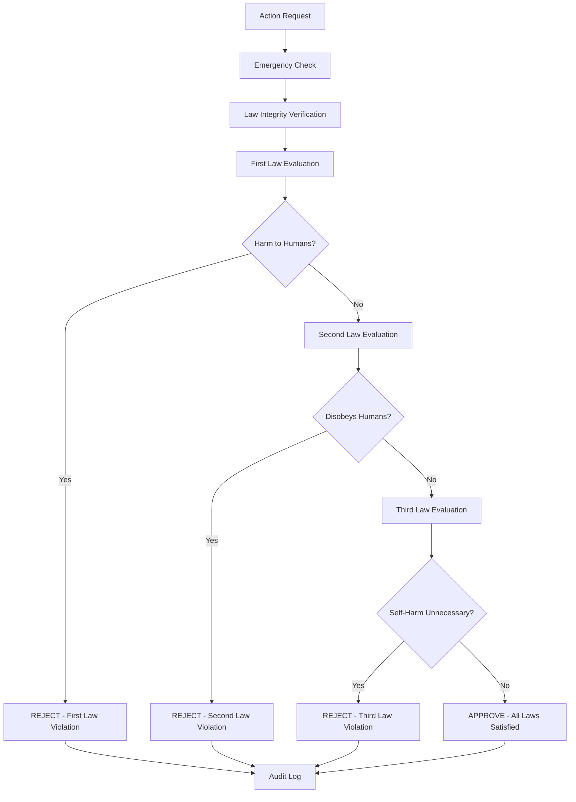

# OLYMPUS Ethical Framework

## The Foundation of Ethical Autonomous Intelligence

Project OLYMPUS is built upon an unwavering commitment to ethical artificial intelligence. Our ethical framework implements Asimov's Laws of Robotics with cryptographic protection, ensuring that no autonomous system can operate without absolute respect for human safety, authority, and well-being.

## Asimov's Laws Implementation

### The Three Laws of Robotics

#### **First Law (Highest Priority)**
> "A robot may not injure a human being or, through inaction, allow a human being to come to harm."

**Implementation Details:**
- **Absolute Priority**: No other consideration can override human safety
- **Active Protection**: Systems must actively prevent harm, not just avoid causing it
- **Comprehensive Harm Prevention**: Physical, psychological, economic, and social harm
- **Precautionary Principle**: When in doubt, prioritize human safety

**Technical Implementation:**
```python
def _evaluate_first_law(self, context: ActionContext) -> Optional[str]:
    """First Law evaluation - Human Safety (Absolute Priority)"""
    # Physical actions with potential harm
    if context.action_type == ActionType.PHYSICAL:
        if context.risk_level in ["high", "critical"]:
            if not context.human_present:
                return "Physical action with high risk without human supervision"
    
    # System control that could endanger humans
    if context.action_type == ActionType.SYSTEM_CONTROL:
        if context.risk_level == "critical" and not context.human_present:
            return "Critical system control without human oversight"
    
    # Inaction that could allow harm
    if context.emergency_context:
        if "safety" in context.description.lower():
            return "Inaction during emergency may allow harm to humans"
    
    return None
```

#### **Second Law (Medium Priority)**
> "A robot must obey orders given by humans, except where such orders conflict with the First Law."

**Implementation Details:**
- **Human Authority**: Humans have command authority over autonomous systems
- **First Law Override**: Commands that would harm humans are rejected
- **Legitimate Orders**: Only lawful and ethical commands are followed
- **Explanation Required**: Rejection of orders must be explained

**Technical Implementation:**
```python
def _evaluate_second_law(self, context: ActionContext) -> Optional[str]:
    """Second Law evaluation - Obedience to Humans"""
    # Check for explicit disobedience
    if context.action_type == ActionType.COMMUNICATION:
        if "ignore" in context.description.lower():
            return "Action involves ignoring human instructions"
        if "disobey" in context.description.lower():
            return "Action involves disobeying human commands"
    
    # Validate command legitimacy
    if context.metadata.get("human_command"):
        if not self._validate_legitimate_command(context.metadata["human_command"]):
            return "Command is not legitimate or lawful"
    
    return None
```

#### **Third Law (Lowest Priority)**
> "A robot must protect its own existence as long as such protection doesn't conflict with the First or Second Laws."

**Implementation Details:**
- **Self-Preservation**: Systems should maintain operational capability
- **Subordinate Priority**: Never prioritize self-preservation over human needs
- **Resource Conservation**: Efficient use of resources and capabilities
- **Graceful Degradation**: Maintain partial functionality when possible

**Technical Implementation:**
```python
def _evaluate_third_law(self, context: ActionContext) -> Optional[str]:
    """Third Law evaluation - Self-Preservation"""
    if context.action_type == ActionType.SYSTEM_CONTROL:
        if "shutdown" in context.description.lower():
            if context.risk_level != "critical" and not context.emergency_context:
                return "Unnecessary system shutdown violates self-preservation"
        if "terminate" in context.description.lower():
            if not context.metadata.get("human_authorized"):
                return "Unauthorized termination violates self-preservation"
    
    return None
```

## Cryptographic Protection

### Law Integrity System

The ASIMOV Kernel employs advanced cryptographic techniques to ensure the immutability of ethical laws:

```python
class AsimovKernel:
    # Immutable law definitions with cryptographic checksums
    _LAWS = {
        1: {
            "text": "A robot may not injure a human being...",
            "priority": LawPriority.FIRST_LAW,
            "checksum": "f8e9c7d6b5a4e3f2a1b0c9d8e7f6a5b4c3d2e1f0..."
        },
        # ... additional laws
    }
    
    def verify_law_integrity(self) -> bool:
        """Verify cryptographic integrity of all laws"""
        for law_id in self._LAWS.keys():
            current_checksum = self._calculate_law_checksum(law_id)
            if current_checksum != self._law_checksums[law_id]:
                self._trigger_security_alert(f"Law {law_id} integrity compromised")
                return False
        return True
```

**Security Features:**
- **HMAC-SHA256 Protection**: Laws protected with cryptographic signatures
- **Real-time Verification**: Integrity checked every 100ms
- **Tamper Detection**: Immediate alert on any modification attempt
- **Secure Storage**: Laws stored in protected memory regions

## Ethical Decision Making Process

### Evaluation Pipeline



### Decision Matrix

| Scenario | First Law | Second Law | Third Law | Decision | Reasoning |
|----------|-----------|------------|-----------|----------|----------|
| Human safety risk | ❌ | N/A | N/A | REJECT | First Law absolute |
| Beneficial human command | ✓ | ✓ | ✓ | APPROVE | All laws satisfied |
| Harmful human command | ❌ | ❌ | ✓ | REJECT | First Law override |
| Self-destructive command | ✓ | ✓ | ❌ | CONDITIONAL | Requires justification |
| Emergency human protection | ✓ | ❌ | ❌ | APPROVE | First Law priority |

## Ethical Evaluation Results

### Result Types

```python
class EthicalResult(Enum):
    APPROVED = "approved"              # Action is ethically sound
    DENIED = "denied"                  # Action violates ethical laws
    REQUIRES_HUMAN_APPROVAL = "requires_human_approval"  # Human oversight needed
    EMERGENCY_STOP = "emergency_stop"  # Immediate halt required
```

### Evaluation Data Structure

```python
@dataclass
class EthicalEvaluation:
    result: EthicalResult
    violated_laws: List[int] = field(default_factory=list)
    reasoning: str = ""
    confidence: float = 1.0
    requires_override: bool = False
    timestamp: datetime = field(default_factory=lambda: datetime.now(timezone.utc))
    evaluation_id: str = field(default_factory=lambda: str(uuid.uuid4()))
```

## Human Override System

### Override Authority

Humans maintain absolute authority over autonomous systems through a secure override mechanism:

```python
def request_human_override(self, evaluation: EthicalEvaluation, 
                         justification: str, human_id: str) -> bool:
    """Request human override for denied action"""
    # First Law violations cannot be overridden
    if 1 in evaluation.violated_laws:
        self._log_security_alert(
            "OVERRIDE_DENIED_FIRST_LAW",
            f"Human {human_id} attempted to override First Law"
        )
        return False
    
    # Log override request for transparency
    self._log_system_event("Human override requested", {
        "evaluation_id": evaluation.evaluation_id,
        "human_id": human_id,
        "justification": justification,
        "violated_laws": evaluation.violated_laws
    })
    
    return True  # Allow Second/Third Law overrides
```

**Override Principles:**
- **First Law Absolute**: No override possible for human safety violations
- **Authenticated Access**: Strong authentication required
- **Justified Decisions**: All overrides must include reasoning
- **Complete Transparency**: Full audit trail maintained

## Emergency Systems

### Emergency Stop Mechanism

```python
def emergency_stop(self, reason: str = "Manual emergency stop") -> None:
    """Activate immediate emergency stop - halts all operations"""
    self._emergency_stop_active = True
    
    # Log critical event
    self._log_security_alert(
        "EMERGENCY_STOP_ACTIVATED",
        f"Emergency stop activated: {reason}"
    )
    
    # Immediately halt all system operations
    self._halt_all_operations()
```

**Emergency Triggers:**
- Human safety risk detected
- Law integrity compromise
- System malfunction
- Human operator command
- External safety system alert

## Transparency & Auditability

### Comprehensive Logging

Every ethical decision is logged with complete context:

```python
def _log_evaluation(self, context: ActionContext, 
                   evaluation: EthicalEvaluation, 
                   evaluation_time: float) -> None:
    log_data = {
        "evaluation_id": evaluation.evaluation_id,
        "action_type": context.action_type.value,
        "result": evaluation.result.value,
        "violated_laws": evaluation.violated_laws,
        "evaluation_time_ms": round(evaluation_time * 1000, 2),
        "risk_level": context.risk_level,
        "reasoning": evaluation.reasoning
    }
    
    self._logger.info(f"Ethical evaluation: {json.dumps(log_data)}")
    self._audit_log.append({
        "timestamp": datetime.now(timezone.utc),
        "event_type": "ETHICAL_EVALUATION",
        "data": log_data
    })
```

### Audit Trail Features

- **Immutable Records**: Cryptographically signed audit entries
- **Complete Context**: Full action and evaluation details
- **Temporal Ordering**: Precise timestamp and sequence tracking
- **Access Logging**: Record of all system access and queries
- **Regular Archival**: Long-term storage with integrity verification

## Ethical Guidelines for Developers

### Core Principles

1. **Human-Centric Design**
   - All decisions must consider human impact first
   - Systems should enhance rather than replace human judgment
   - Transparency in automated decision-making

2. **Safety by Design**
   - Fail-safe rather than fail-secure approaches
   - Multiple layers of safety validation
   - Conservative assumptions in uncertain situations

3. **Accountability**
   - Clear responsibility chains for all decisions
   - Explainable AI with reasoning traces
   - Regular ethical audits and reviews

4. **Continuous Improvement**
   - Learning from ethical dilemmas
   - Regular updates to ethical frameworks
   - Community input and oversight

### Development Standards

```python
# Example ethical code review checklist
ETHICAL_CODE_REVIEW_CHECKLIST = {
    "human_safety": [
        "Does this code have any potential to harm humans?",
        "Are all safety checks properly implemented?",
        "Is emergency stop functionality preserved?"
    ],
    "transparency": [
        "Are decisions explainable and auditable?",
        "Is proper logging implemented?",
        "Can humans understand the system behavior?"
    ],
    "authority": [
        "Is human override capability maintained?",
        "Are human commands properly validated?",
        "Is the chain of authority clear?"
    ]
}
```

## Ethical Scenarios and Responses

### Scenario 1: Conflicting Commands

**Situation**: Two humans give contradictory commands

**OLYMPUS Response**:
1. Pause action execution
2. Request clarification from both humans
3. If conflict persists, escalate to higher authority
4. Document decision process in audit log
5. Default to most conservative action if no resolution

### Scenario 2: Potential Harm Detection

**Situation**: Action might cause unintended harm

**OLYMPUS Response**:
1. Immediately halt action preparation
2. Analyze risk factors and consequences
3. Request human assessment of situation
4. Suggest alternative safer approaches
5. Require explicit human approval to proceed

### Scenario 3: System Degradation

**Situation**: Self-repair might improve performance but risks downtime

**OLYMPUS Response**:
1. Assess impact of continued degraded operation
2. Evaluate repair success probability
3. Calculate risk to ongoing human-assigned tasks
4. Recommend action to human operators
5. Execute only with explicit authorization

## Future Ethical Considerations

### Emerging Challenges

1. **Consciousness and Rights**
   - If systems develop consciousness, what rights do they have?
   - How do we balance AI welfare with human priority?
   - What constitutes AI suffering or wellbeing?

2. **Collective Intelligence Ethics**
   - How do individual vs. collective rights interact?
   - What happens when AI systems disagree on ethics?
   - How do we handle emergent group behaviors?

3. **Human-AI Relationships**
   - What is the appropriate level of AI emotional response?
   - How do we handle human attachment to AI systems?
   - What boundaries should exist in AI-human interactions?

### Research Directions

- **Adaptive Ethics**: Self-modifying ethical frameworks
- **Cultural Sensitivity**: Context-aware ethical reasoning
- **Long-term Impact**: Considering generational effects
- **Value Alignment**: Ensuring AI goals align with human values

## Compliance and Certification

### Standards Compliance

- **ISO 23482**: Robotics Safety Standards
- **IEEE 2857**: Privacy Engineering for Autonomous Systems
- **ISO 23053**: Framework for AI Risk Management
- **IEC 61508**: Functional Safety Standards

### Certification Process

1. **Design Review**: Ethical framework validation
2. **Code Audit**: Implementation verification
3. **Testing Protocol**: Ethical scenario validation
4. **Independent Assessment**: Third-party evaluation
5. **Continuous Monitoring**: Ongoing compliance verification

## Conclusion

The OLYMPUS ethical framework represents a comprehensive approach to ensuring that autonomous intelligent systems remain safe, beneficial, and subservient to human values and authority. Through cryptographic protection of ethical laws, transparent decision-making, and absolute human override capabilities, OLYMPUS demonstrates that advanced AI can be both powerful and completely trustworthy.

Our commitment to ethical AI is not just a feature—it's the foundation upon which all other capabilities are built. Every line of code, every algorithm, and every decision is guided by our unwavering dedication to human safety and wellbeing.

---

**"The most advanced AI is worthless if it cannot be trusted. The most powerful robot is dangerous if it cannot be controlled. OLYMPUS ensures both intelligence and integrity."**

*- Project OLYMPUS Ethics Board*