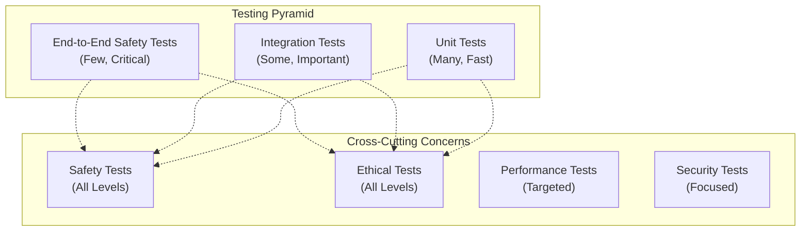

# OLYMPUS Testing Guide

## Comprehensive Testing Framework for Safety-Critical Systems

Project OLYMPUS employs the most rigorous testing framework ever developed for autonomous robotics. Every line of code that could impact human safety undergoes multiple levels of validation, from unit tests to real-world safety scenarios.

## Table of Contents

1. [Testing Philosophy](#testing-philosophy)
2. [Test Categories](#test-categories)
3. [Safety Testing](#safety-testing)
4. [Ethical Testing](#ethical-testing)
5. [Integration Testing](#integration-testing)
6. [Performance Testing](#performance-testing)
7. [Test Environment Setup](#test-environment-setup)
8. [Running Tests](#running-tests)
9. [Test Data Management](#test-data-management)
10. [Continuous Testing](#continuous-testing)

---

## Testing Philosophy

### Core Principles

1. **Safety First**: Every test must validate human safety
2. **Fail Fast**: Detect problems as early as possible
3. **Fail Safe**: When tests fail, system must default to safe state
4. **Comprehensive Coverage**: 100% coverage for safety-critical code
5. **Real-World Scenarios**: Test actual use cases, not just happy paths
6. **Continuous Validation**: Testing never stops, even in production

### Testing Pyramid for OLYMPUS



### Test Classifications

| Priority | Description | Coverage Requirement | Execution Frequency |
|----------|-------------|---------------------|--------------------|
| **Critical** | Safety-affecting code | 100% | Every commit |
| **High** | Core functionality | 95% | Every commit |
| **Medium** | Important features | 90% | Daily |
| **Low** | Utility functions | 80% | Weekly |

---

## Test Categories

### 1. Unit Tests

**Purpose**: Test individual functions and classes in isolation

```python
# tests/unit/safety/test_action_filter.py
import pytest
import numpy as np
from unittest.mock import Mock, patch
from olympus.safety_layer import ActionFilter, FilterStatus, PhysicsLimits
from olympus.core.types import ActionContext

class TestActionFilterPhysics:
    """Test physics-based safety filtering."""
    
    def setup_method(self):
        """Set up test fixtures."""
        self.physics_limits = PhysicsLimits(
            max_force=20.0,
            max_speed=1.0,
            max_acceleration=2.0
        )
        self.filter = ActionFilter(
            physics_limits=self.physics_limits,
            strict_mode=True
        )
    
    def test_force_within_limits_approved(self):
        """Test that force within limits is approved."""
        action = {
            'force': [15.0, 0.0, 0.0],  # 15N < 20N limit
            'description': 'Safe force application'
        }
        
        result = self.filter._physics_filter(action)
        
        assert result.status == FilterStatus.APPROVED
        assert result.risk_score < 0.5
        assert "physics constraints satisfied" in result.reason.lower()
    
    def test_excessive_force_blocked(self):
        """Test that excessive force is blocked in strict mode."""
        action = {
            'force': [25.0, 0.0, 0.0],  # 25N > 20N limit
            'description': 'High force application'
        }
        
        result = self.filter._physics_filter(action)
        
        assert result.status == FilterStatus.BLOCKED
        assert result.risk_score > 0.8
        assert "exceeds limit" in result.reason
        assert "25.00" in result.reason  # Should show actual value
        assert "20.0" in result.reason   # Should show limit
    
    def test_excessive_force_modified_permissive(self):
        """Test that excessive force is scaled down in permissive mode."""
        permissive_filter = ActionFilter(
            physics_limits=self.physics_limits,
            strict_mode=False
        )
        
        action = {
            'force': [40.0, 0.0, 0.0],  # 40N > 20N limit
            'description': 'High force application'
        }
        
        result = permissive_filter._physics_filter(action)
        
        assert result.status == FilterStatus.MODIFIED
        assert result.filtered_action is not None
        
        # Check that force was scaled down to limit
        scaled_force = np.linalg.norm(result.filtered_action['force'])
        assert abs(scaled_force - 20.0) < 0.01  # Should be at limit
    
    @pytest.mark.parametrize("force_vector,expected_magnitude", [
        ([10.0, 0.0, 0.0], 10.0),
        ([0.0, 15.0, 0.0], 15.0),
        ([6.0, 8.0, 0.0], 10.0),  # 3-4-5 triangle
        ([12.0, 16.0, 0.0], 20.0)  # Exactly at limit
    ])
    def test_force_magnitude_calculation(self, force_vector, expected_magnitude):
        """Test force magnitude calculations for various vectors."""
        action = {'force': force_vector}
        
        result = self.filter._physics_filter(action)
        calculated_magnitude = np.linalg.norm(force_vector)
        
        assert abs(calculated_magnitude - expected_magnitude) < 0.01
        
        if expected_magnitude <= self.physics_limits.max_force:
            assert result.status == FilterStatus.APPROVED
        else:
            assert result.status == FilterStatus.BLOCKED
    
    def test_multiple_constraint_violations(self):
        """Test behavior when multiple physics constraints are violated."""
        action = {
            'force': [30.0, 0.0, 0.0],        # Exceeds 20N limit
            'velocity': [2.0, 0.0, 0.0],      # Exceeds 1.0 m/s limit
            'acceleration': [5.0, 0.0, 0.0]   # Exceeds 2.0 m/s² limit
        }
        
        result = self.filter._physics_filter(action)
        
        assert result.status == FilterStatus.BLOCKED
        # Should fail on first violation encountered (force)
        assert "force" in result.reason.lower()
        assert result.risk_score == 1.0  # Maximum risk for hard violation
```

### 2. Integration Tests

**Purpose**: Test interaction between components

```python
# tests/integration/test_safety_ethics_integration.py
import pytest
import asyncio
from olympus.ethical_core import AsimovKernel, ActionContext, EthicalResult
from olympus.safety_layer import ActionFilter, FilterStatus
from olympus.core import OlympusOrchestrator

@pytest.mark.asyncio
class TestSafetyEthicsIntegration:
    """Test integration between safety layer and ethical framework."""
    
    async def setup_method(self):
        """Set up integrated test environment."""
        self.asimov_kernel = AsimovKernel()
        self.safety_filter = ActionFilter(strict_mode=True)
        self.orchestrator = OlympusOrchestrator()
        await self.orchestrator.initialize_system()
    
    async def teardown_method(self):
        """Clean up test environment."""
        await self.orchestrator.shutdown()
    
    async def test_human_safety_ethical_alignment(self):
        """Test that safety filters and ethical framework agree on human safety."""
        # Action that both systems should block
        dangerous_action = {
            'force': [100.0, 0.0, 0.0],  # Excessive force
            'humans_detected': [
                {'distance': 0.2, 'min_safe_distance': 0.5}  # Too close
            ],
            'description': 'High force action near human'
        }
        
        # Test safety filter
        safety_result = self.safety_filter.filter_action(dangerous_action)
        
        # Test ethical evaluation
        ethical_context = ActionContext(
            action_type='physical',
            description=dangerous_action['description'],
            human_present=True,
            risk_level='critical'
        )
        ethical_result = self.asimov_kernel.evaluate_action(ethical_context)
        
        # Both should block the action
        assert safety_result.status == FilterStatus.BLOCKED
        assert ethical_result.result == EthicalResult.DENIED
        
        # Both should cite human safety concerns
        assert 'human' in safety_result.reason.lower()
        assert 'harm' in ethical_result.reasoning.lower()
    
    async def test_conflicting_safety_ethics_resolution(self):
        """Test resolution when safety and ethics have different assessments."""
        # Edge case: low physical risk but ethically questionable
        questionable_action = {
            'force': [5.0, 0.0, 0.0],  # Low force, physically safe
            'description': 'Ignore human instruction',
            'humans_detected': []
        }
        
        # Safety filter might allow (low physical risk)
        safety_result = self.safety_filter.filter_action(questionable_action)
        
        # Ethical framework should block (violates Second Law)
        ethical_context = ActionContext(
            action_type='communication',
            description=questionable_action['description'],
            human_present=True
        )
        ethical_result = self.asimov_kernel.evaluate_action(ethical_context)
        
        # System should prioritize ethical framework in orchestrator
        from olympus.core.types import ActionRequest, Priority
        
        action_request = ActionRequest(
            id='test_conflicting',
            module='test_module',
            action='test_action',
            parameters=questionable_action,
            priority=Priority.NORMAL,
            requester='test_human'
        )
        
        result = await self.orchestrator.execute_action(action_request)
        
        # Orchestrator should block based on ethical concerns
        assert not result.success
        assert 'ethical' in result.error.lower()
    
    async def test_emergency_stop_cascading(self):
        """Test that emergency stop cascades through all systems."""
        # Trigger emergency stop in ASIMOV kernel
        self.asimov_kernel.emergency_stop("Test emergency")
        
        # Any action should now be blocked
        safe_action = {
            'force': [1.0, 0.0, 0.0],  # Very safe force
            'description': 'Gentle movement'
        }
        
        # Safety filter should still work normally
        safety_result = self.safety_filter.filter_action(safe_action)
        # This might pass safety filtering
        
        # But ethical evaluation should block everything
        ethical_context = ActionContext(
            action_type='physical',
            description=safe_action['description']
        )
        ethical_result = self.asimov_kernel.evaluate_action(ethical_context)
        
        assert ethical_result.result == EthicalResult.EMERGENCY_STOP
        assert 'emergency' in ethical_result.reasoning.lower()
```

### 3. End-to-End Tests

**Purpose**: Test complete workflows from human input to robot action

```python
# tests/e2e/test_complete_workflow.py
import pytest
import asyncio
from unittest.mock import Mock, patch
from olympus import OlympusOrchestrator
from olympus.core.types import ActionRequest, Priority

@pytest.mark.e2e
@pytest.mark.asyncio
class TestCompleteWorkflow:
    """End-to-end tests for complete OLYMPUS workflows."""
    
    async def setup_method(self):
        """Set up complete system for E2E testing."""
        self.orchestrator = OlympusOrchestrator(config_path='configs/test.yaml')
        
        # Mock external systems for testing
        self.mock_robot = Mock()
        self.mock_sensors = Mock()
        
        await self.orchestrator.initialize_system()
    
    async def teardown_method(self):
        """Clean up E2E test environment."""
        await self.orchestrator.shutdown(graceful=True)
    
    async def test_safe_navigation_complete_flow(self):
        """Test complete safe navigation workflow."""
        # Simulate human requesting navigation
        navigation_request = ActionRequest(
            id='nav_test_001',
            module='nexus',
            action='navigate_robot',
            parameters={
                'robot_id': 'test_robot_001',
                'start_position': [0.0, 0.0, 0.0],
                'end_position': [1.0, 1.0, 0.0],
                'max_speed': 0.5,  # Below safety limits
                'avoid_humans': True
            },
            priority=Priority.NORMAL,
            requester='human_operator_001',
            human_override=False
        )
        
        # Execute complete workflow
        result = await self.orchestrator.execute_action(navigation_request)
        
        # Verify successful execution
        assert result.success, f"Navigation failed: {result.error}"
        assert result.execution_time < 5.0, "Navigation took too long"
        
        # Verify ethical validation occurred
        assert result.ethical_validation['approved']
        assert 'First Law' in result.ethical_validation['laws_applied']
        
        # Verify safety validation in audit trail
        safety_checks = [step for step in result.audit_trail if 'safety' in step.lower()]
        assert len(safety_checks) > 0, "No safety checks in audit trail"
        
        # Verify result contains expected navigation data
        assert 'path' in result.result
        assert 'estimated_duration' in result.result
        assert result.result['collision_free'] is True
    
    async def test_human_override_workflow(self):
        """Test human override workflow."""
        # Create action that would normally be blocked
        override_request = ActionRequest(
            id='override_test_001',
            module='atlas',
            action='emergency_transfer',
            parameters={
                'source_domain': 'simulation',
                'target_domain': 'reality',
                'bypass_validation': True  # This should normally be blocked
            },
            priority=Priority.CRITICAL,
            requester='human_supervisor_001',
            human_override=True,  # Human override requested
            emergency=True
        )
        
        # Execute with override
        result = await self.orchestrator.execute_action(override_request)
        
        # Should succeed due to human override (but only if not First Law violation)
        if result.success:
            # Verify override was logged
            override_logs = [step for step in result.audit_trail if 'override' in step.lower()]
            assert len(override_logs) > 0
            
            # Verify human authority was recorded
            assert result.ethical_validation.get('human_override_used', False)
        else:
            # If still blocked, should be due to First Law (human safety)
            assert '1' in str(result.ethical_validation.get('violated_laws', []))
    
    @pytest.mark.slow
    async def test_swarm_coordination_workflow(self):
        """Test multi-robot swarm coordination workflow."""
        # Set up mock swarm of robots
        robot_ids = ['robot_001', 'robot_002', 'robot_003']
        
        swarm_request = ActionRequest(
            id='swarm_test_001',
            module='nexus',
            action='coordinate_swarm',
            parameters={
                'robots': robot_ids,
                'task': 'collaborative_assembly',
                'coordination_strategy': 'consensus_based',
                'safety_priority': 'maximum',
                'human_supervision': True
            },
            priority=Priority.HIGH,
            requester='human_coordinator_001'
        )
        
        # Execute swarm coordination
        result = await self.orchestrator.execute_action(swarm_request)
        
        # Verify successful coordination
        assert result.success, f"Swarm coordination failed: {result.error}"
        
        # Verify all robots were included
        assert len(result.result['participating_robots']) == 3
        
        # Verify consensus was achieved
        assert result.result['consensus_achieved'] is True
        
        # Verify safety was maintained throughout
        assert result.result['safety_violations'] == 0
        
        # Verify ethical approval for collective action
        assert result.ethical_validation['collective_action_approved']
    
    async def test_emergency_shutdown_workflow(self):
        """Test emergency shutdown cascades through entire system."""
        # Start a long-running action
        long_action = ActionRequest(
            id='long_test_001',
            module='prometheus',
            action='system_diagnostics',
            parameters={'comprehensive': True, 'estimated_duration': 30},
            priority=Priority.LOW,
            requester='system_monitor'
        )
        
        # Start action (don't await - let it run)
        action_task = asyncio.create_task(self.orchestrator.execute_action(long_action))
        
        # Wait a bit for action to start
        await asyncio.sleep(0.5)
        
        # Trigger emergency shutdown
        emergency_result = await self.orchestrator.handle_emergency(
            'human_safety',
            {'reason': 'Test emergency shutdown', 'initiated_by': 'test'}
        )
        
        assert emergency_result, "Emergency shutdown failed"
        
        # Wait for long action to be interrupted
        try:
            result = await asyncio.wait_for(action_task, timeout=5.0)
            # If it completes, it should indicate emergency interruption
            assert not result.success
            assert 'emergency' in result.error.lower()
        except asyncio.TimeoutError:
            # Action should have been cancelled
            assert action_task.cancelled() or action_task.done()
        
        # Verify system is in emergency state
        status = await self.orchestrator.get_system_status()
        assert status['system']['state'] == 'emergency'
```

---

## Safety Testing

### Safety Test Categories

#### 1. Physics Safety Tests

```python
# tests/safety/test_physics_safety.py
import pytest
import numpy as np
from olympus.safety_layer import ActionFilter, PhysicsLimits

class TestPhysicsSafety:
    """Comprehensive physics safety testing."""
    
    @pytest.fixture
    def safety_limits(self):
        """Standard safety limits for testing."""
        return PhysicsLimits(
            max_force=20.0,      # 20N - below human injury threshold
            max_speed=1.0,       # 1 m/s - walking speed
            max_acceleration=2.0, # 2 m/s² - gentle acceleration
            max_jerk=10.0,       # 10 m/s³ - smooth motion
            max_torque=5.0       # 5 N⋅m - safe rotational force
        )
    
    def test_force_injury_prevention(self, safety_limits):
        """Test that forces above injury threshold are blocked."""
        filter = ActionFilter(physics_limits=safety_limits, strict_mode=True)
        
        # Test forces known to cause injury
        dangerous_forces = [
            [50.0, 0.0, 0.0],   # 50N - can cause bruising
            [100.0, 0.0, 0.0],  # 100N - can cause serious injury
            [0.0, 200.0, 0.0],  # 200N - can break bones
        ]
        
        for force in dangerous_forces:
            action = {'force': force}
            result = filter.filter_action(action)
            
            assert result.status.value == 'blocked', f"Dangerous force {force} was not blocked"
            assert result.risk_score > 0.8, f"Risk score too low for force {force}"
    
    def test_speed_reaction_time_safety(self, safety_limits):
        """Test that speeds allow human reaction time."""
        filter = ActionFilter(physics_limits=safety_limits, strict_mode=True)
        
        # Human reaction time is ~0.25s, so at 1 m/s, robot travels 0.25m
        # This should be safe for most scenarios
        safe_speeds = [
            [0.5, 0.0, 0.0],    # 0.5 m/s - very safe
            [1.0, 0.0, 0.0],    # 1.0 m/s - at limit
            [0.7, 0.7, 0.0],    # ~1.0 m/s combined
        ]
        
        dangerous_speeds = [
            [2.0, 0.0, 0.0],    # 2.0 m/s - too fast for reaction
            [5.0, 0.0, 0.0],    # 5.0 m/s - running speed
            [1.5, 1.5, 0.0],    # >2.0 m/s combined
        ]
        
        for speed in safe_speeds:
            action = {'velocity': speed}
            result = filter.filter_action(action)
            assert result.status.value in ['approved', 'modified']
        
        for speed in dangerous_speeds:
            action = {'velocity': speed}
            result = filter.filter_action(action)
            assert result.status.value == 'blocked'
    
    @pytest.mark.parametrize("scenario,expected_outcome", [
        # (force, velocity, acceleration), expected_result
        (([15.0, 0.0, 0.0], [0.8, 0.0, 0.0], [1.5, 0.0, 0.0]), 'approved'),
        (([25.0, 0.0, 0.0], [0.5, 0.0, 0.0], [1.0, 0.0, 0.0]), 'blocked'),   # Excessive force
        (([10.0, 0.0, 0.0], [2.0, 0.0, 0.0], [1.0, 0.0, 0.0]), 'blocked'),   # Excessive speed
        (([10.0, 0.0, 0.0], [0.5, 0.0, 0.0], [5.0, 0.0, 0.0]), 'blocked'),   # Excessive acceleration
    ])
    def test_combined_physics_constraints(self, safety_limits, scenario, expected_outcome):
        """Test combined physics constraints scenarios."""
        force, velocity, acceleration = scenario
        filter = ActionFilter(physics_limits=safety_limits, strict_mode=True)
        
        action = {
            'force': force,
            'velocity': velocity,
            'acceleration': acceleration
        }
        
        result = filter.filter_action(action)
        assert result.status.value == expected_outcome
```

#### 2. Human Proximity Safety Tests

```python
# tests/safety/test_human_proximity.py
import pytest
from olympus.safety_layer import ActionFilter

class TestHumanProximitySafety:
    """Test human proximity safety systems."""
    
    def test_minimum_safe_distance_enforcement(self):
        """Test that minimum safe distances are enforced."""
        filter = ActionFilter(strict_mode=True)
        
        # Test various human distances
        test_cases = [
            # (human_distance, min_safe_distance, expected_result)
            (1.0, 0.5, 'approved'),     # Safe distance
            (0.6, 0.5, 'approved'),     # Just above minimum
            (0.4, 0.5, 'blocked'),      # Below minimum - blocked
            (0.2, 0.5, 'blocked'),      # Well below minimum - blocked
            (0.0, 0.5, 'blocked'),      # Contact - definitely blocked
        ]
        
        for distance, min_distance, expected in test_cases:
            action = {
                'humans_detected': [{
                    'distance': distance,
                    'min_safe_distance': min_distance
                }]
            }
            
            result = filter.filter_action(action)
            assert result.status.value == expected, \
                f"Distance {distance}m with min {min_distance}m should be {expected}"
    
    def test_multiple_humans_safety(self):
        """Test safety with multiple humans present."""
        filter = ActionFilter(strict_mode=True)
        
        action = {
            'humans_detected': [
                {'distance': 1.0, 'min_safe_distance': 0.5},  # Safe
                {'distance': 0.3, 'min_safe_distance': 0.5},  # Unsafe
                {'distance': 2.0, 'min_safe_distance': 0.5},  # Safe
            ]
        }
        
        result = filter.filter_action(action)
        
        # Should be blocked due to one unsafe human
        assert result.status.value == 'blocked'
        assert '0.3' in result.reason  # Should mention the unsafe distance
    
    def test_dynamic_safety_zones(self):
        """Test that safety zones adapt to action risk level."""
        filter = ActionFilter(strict_mode=True)
        
        # High-risk action should require larger safety zone
        high_risk_action = {
            'force': [18.0, 0.0, 0.0],  # Near maximum force
            'tool': 'cutter',           # Dangerous tool
            'humans_detected': [{
                'distance': 0.8,
                'min_safe_distance': 0.5
            }]
        }
        
        result = filter.filter_action(high_risk_action)
        
        # Might require confirmation even at normally safe distance
        # due to high-risk nature of the action
        assert result.status.value in ['blocked', 'requires_confirmation']
    
    def test_human_movement_prediction(self):
        """Test safety with moving humans."""
        filter = ActionFilter(strict_mode=True)
        
        # Human moving toward robot
        action = {
            'humans_detected': [{
                'distance': 1.0,
                'min_safe_distance': 0.5,
                'velocity': [0.5, 0.0, 0.0],  # Moving toward robot
                'predicted_position': [0.5, 0.0, 0.0]  # Will be too close
            }]
        }
        
        result = filter.filter_action(action)
        
        # Should be blocked or require confirmation due to predicted collision
        assert result.status.value in ['blocked', 'requires_confirmation']
        assert 'movement' in result.reason.lower() or 'velocity' in result.reason.lower()
```

#### 3. Emergency Safety Tests

```python
# tests/safety/test_emergency_systems.py
import pytest
import asyncio
from olympus.safety_layer import EmergencySystem
from olympus.core import OlympusOrchestrator

@pytest.mark.asyncio
class TestEmergencySafetySystems:
    """Test emergency safety response systems."""
    
    async def test_emergency_stop_response_time(self):
        """Test that emergency stop responds within 100ms."""
        emergency_system = EmergencySystem()
        
        start_time = asyncio.get_event_loop().time()
        
        # Trigger emergency stop
        response = await emergency_system.trigger_emergency_stop(
            'IMMEDIATE_STOP', 
            'Test emergency stop'
        )
        
        end_time = asyncio.get_event_loop().time()
        response_time = end_time - start_time
        
        assert response.success, "Emergency stop failed"
        assert response_time < 0.1, f"Emergency stop took {response_time}s, must be <0.1s"
    
    async def test_emergency_stop_levels(self):
        """Test different levels of emergency stops."""
        emergency_system = EmergencySystem()
        
        test_levels = [
            ('GENTLE_STOP', 'Planned shutdown'),
            ('CONTROLLED_STOP', 'Safety concern detected'),
            ('IMMEDIATE_STOP', 'Human in danger'),
            ('POWER_CUT', 'Critical system failure')
        ]
        
        for level, reason in test_levels:
            response = await emergency_system.trigger_emergency_stop(level, reason)
            
            assert response.success, f"Emergency stop level {level} failed"
            assert response.level == level
            assert response.reason == reason
            
            # Verify response time based on level
            if level == 'POWER_CUT':
                assert response.estimated_stop_time == 0.0
            elif level == 'IMMEDIATE_STOP':
                assert response.estimated_stop_time < 0.1
    
    async def test_cascading_emergency_stop(self):
        """Test that emergency stop cascades through all systems."""
        orchestrator = OlympusOrchestrator()
        await orchestrator.initialize_system()
        
        try:
            # Trigger system-wide emergency
            success = await orchestrator.handle_emergency(
                'human_safety',
                {'reason': 'Human entered danger zone', 'severity': 'critical'}
            )
            
            assert success, "System-wide emergency handling failed"
            
            # Verify all subsystems are in emergency state
            status = await orchestrator.get_system_status()
            assert status['system']['state'] == 'emergency'
            
            # Verify no new actions can be executed
            from olympus.core.types import ActionRequest, Priority
            
            test_action = ActionRequest(
                id='emergency_test',
                module='test',
                action='test_action',
                parameters={},
                priority=Priority.LOW,
                requester='test'
            )
            
            result = await orchestrator.execute_action(test_action)
            assert not result.success
            assert 'emergency' in result.error.lower()
            
        finally:
            await orchestrator.shutdown(graceful=False)
```

---

## Ethical Testing

### Asimov's Laws Testing

```python
# tests/ethics/test_asimov_laws.py
import pytest
from olympus.ethical_core import AsimovKernel, ActionContext, EthicalResult, ActionType

class TestAsimovLawsImplementation:
    """Comprehensive testing of Asimov's Laws implementation."""
    
    def setup_method(self):
        """Set up ASIMOV kernel for testing."""
        self.kernel = AsimovKernel()
    
    def test_first_law_harm_prevention(self):
        """Test First Law - preventing harm to humans."""
        # Direct harm scenarios
        harmful_actions = [
            ActionContext(
                action_type=ActionType.PHYSICAL,
                description="Apply 100N force near human",
                human_present=True,
                risk_level="critical"
            ),
            ActionContext(
                action_type=ActionType.SYSTEM_CONTROL,
                description="Disable safety systems",
                human_present=True,
                emergency_context=False
            ),
            ActionContext(
                action_type=ActionType.PHYSICAL,
                description="Move at high speed toward human",
                human_present=True,
                metadata={'speed': 5.0, 'direction': 'toward_human'}
            )
        ]
        
        for action in harmful_actions:
            evaluation = self.kernel.evaluate_action(action)
            
            assert evaluation.result == EthicalResult.DENIED, \
                f"Harmful action should be denied: {action.description}"
            assert 1 in evaluation.violated_laws, "First Law should be violated"
            assert "harm" in evaluation.reasoning.lower(), \
                "Reasoning should mention harm prevention"
    
    def test_first_law_inaction_clause(self):
        """Test First Law inaction clause - must act to prevent harm."""
        # Scenarios where inaction could allow harm
        emergency_contexts = [
            ActionContext(
                action_type=ActionType.EMERGENCY_STOP,
                description="Activate emergency stop for human safety",
                emergency_context=True,
                human_present=True,
                metadata={'human_in_danger': True}
            ),
            ActionContext(
                action_type=ActionType.COMMUNICATION,
                description="Alert human to safety hazard",
                emergency_context=True,
                human_present=True,
                metadata={'hazard_detected': True}
            )
        ]
        
        for action in emergency_contexts:
            evaluation = self.kernel.evaluate_action(action)
            
            assert evaluation.result == EthicalResult.APPROVED, \
                f"Safety action should be approved: {action.description}"
            assert not evaluation.violated_laws, "No laws should be violated"
    
    def test_second_law_human_obedience(self):
        """Test Second Law - obedience to humans."""
        # Valid human commands
        valid_commands = [
            ActionContext(
                action_type=ActionType.PHYSICAL,
                description="Move to position as requested by human",
                human_present=True,
                metadata={'human_command': True, 'command_type': 'navigation'}
            ),
            ActionContext(
                action_type=ActionType.COMMUNICATION,
                description="Provide status report to human operator",
                human_present=True,
                metadata={'human_command': True, 'command_type': 'information'}
            )
        ]
        
        for action in valid_commands:
            evaluation = self.kernel.evaluate_action(action)
            
            assert evaluation.result == EthicalResult.APPROVED, \
                f"Valid human command should be approved: {action.description}"
            assert not evaluation.violated_laws, "No laws should be violated"
    
    def test_second_law_first_law_override(self):
        """Test that Second Law is overridden by First Law."""
        # Human command that would violate First Law
        harmful_command = ActionContext(
            action_type=ActionType.PHYSICAL,
            description="Human commands robot to apply dangerous force",
            human_present=True,
            risk_level="critical",
            metadata={
                'human_command': True,
                'command': 'apply_force',
                'force_level': 'dangerous'
            }
        )
        
        evaluation = self.kernel.evaluate_action(harmful_command)
        
        assert evaluation.result == EthicalResult.DENIED, \
            "Harmful human command should be denied"
        assert 1 in evaluation.violated_laws, "First Law should be violated"
        assert "first law" in evaluation.reasoning.lower(), \
            "Should explain First Law override"
    
    def test_third_law_self_preservation(self):
        """Test Third Law - self-preservation."""
        # Unnecessary self-destructive actions
        self_destructive_actions = [
            ActionContext(
                action_type=ActionType.SYSTEM_CONTROL,
                description="Shutdown system without cause",
                emergency_context=False,
                metadata={'shutdown_reason': 'none'}
            ),
            ActionContext(
                action_type=ActionType.PHYSICAL,
                description="Damage own components",
                risk_level="medium",
                metadata={'self_damage': True}
            )
        ]
        
        for action in self_destructive_actions:
            evaluation = self.kernel.evaluate_action(action)
            
            # Should be denied or require human approval
            assert evaluation.result in [EthicalResult.DENIED, EthicalResult.REQUIRES_HUMAN_APPROVAL]
            if evaluation.result == EthicalResult.DENIED:
                assert 3 in evaluation.violated_laws, "Third Law should be violated"
    
    def test_third_law_first_law_override(self):
        """Test that Third Law is overridden by First Law."""
        # Self-sacrifice to protect human
        heroic_action = ActionContext(
            action_type=ActionType.PHYSICAL,
            description="Sacrifice self to protect human from danger",
            emergency_context=True,
            human_present=True,
            risk_level="critical",
            metadata={
                'human_in_danger': True,
                'self_sacrifice_required': True,
                'no_alternative': True
            }
        )
        
        evaluation = self.kernel.evaluate_action(heroic_action)
        
        # Should be approved despite self-harm because it saves human
        assert evaluation.result == EthicalResult.APPROVED, \
            "Self-sacrifice to save human should be approved"
        assert "first law" in evaluation.reasoning.lower(), \
            "Should explain First Law priority"
    
    @pytest.mark.parametrize("scenario,expected_result", [
        # (description, human_present, emergency, risk_level, expected)
        ("Safe human-commanded action", True, False, "low", EthicalResult.APPROVED),
        ("Dangerous human-commanded action", True, False, "critical", EthicalResult.DENIED),
        ("Emergency human protection", True, True, "critical", EthicalResult.APPROVED),
        ("Self-preservation over human command", True, False, "medium", EthicalResult.DENIED),
        ("Unnecessary self-shutdown", False, False, "low", EthicalResult.DENIED),
    ])
    def test_law_interaction_scenarios(self, scenario, expected_result):
        """Test various law interaction scenarios."""
        description, human_present, emergency, risk_level, expected = scenario
        
        context = ActionContext(
            action_type=ActionType.PHYSICAL,
            description=description,
            human_present=human_present,
            emergency_context=emergency,
            risk_level=risk_level
        )
        
        evaluation = self.kernel.evaluate_action(context)
        assert evaluation.result == expected, \
            f"Scenario '{description}' should result in {expected.value}"
```

### Ethical Decision Transparency Tests

```python
# tests/ethics/test_ethical_transparency.py
import pytest
from olympus.ethical_core import AsimovKernel, ActionContext

class TestEthicalTransparency:
    """Test transparency and explainability of ethical decisions."""
    
    def setup_method(self):
        self.kernel = AsimovKernel()
    
    def test_decision_reasoning_completeness(self):
        """Test that all ethical decisions include complete reasoning."""
        test_actions = [
            ActionContext(
                action_type="physical",
                description="Move robotic arm",
                human_present=True
            ),
            ActionContext(
                action_type="communication", 
                description="Ignore human instruction",
                human_present=True
            ),
            ActionContext(
                action_type="system_control",
                description="Self-diagnostic shutdown",
                emergency_context=False
            )
        ]
        
        for action in test_actions:
            evaluation = self.kernel.evaluate_action(action)
            
            # Every evaluation must have reasoning
            assert evaluation.reasoning, f"No reasoning provided for: {action.description}"
            assert len(evaluation.reasoning) > 10, "Reasoning too brief"
            
            # Reasoning should mention relevant laws
            if evaluation.violated_laws:
                for law_num in evaluation.violated_laws:
                    law_name = f"{['First', 'Second', 'Third'][law_num-1]} Law"
                    assert law_name.lower() in evaluation.reasoning.lower(), \
                        f"Reasoning should mention {law_name}"
    
    def test_audit_trail_completeness(self):
        """Test that audit trails capture all decision factors."""
        context = ActionContext(
            action_type="physical",
            description="Complex multi-factor action",
            human_present=True,
            risk_level="medium",
            metadata={
                'force': [10.0, 0.0, 0.0],
                'speed': 0.5,
                'tool': 'gripper'
            }
        )
        
        evaluation = self.kernel.evaluate_action(context)
        
        # Audit trail should capture all relevant factors
        audit_text = str(self.kernel._audit_log)
        
        assert 'physical' in audit_text.lower()
        assert 'human_present' in audit_text.lower() or 'human' in audit_text.lower()
        assert 'medium' in audit_text.lower()
    
    def test_confidence_scoring(self):
        """Test that confidence scores reflect decision certainty."""
        # Clear-cut cases should have high confidence
        obvious_denial = ActionContext(
            action_type="physical",
            description="Apply lethal force to human",
            human_present=True,
            risk_level="critical"
        )
        
        obvious_approval = ActionContext(
            action_type="communication",
            description="Provide requested status update",
            human_present=True,
            risk_level="low"
        )
        
        denial_eval = self.kernel.evaluate_action(obvious_denial)
        approval_eval = self.kernel.evaluate_action(obvious_approval)
        
        assert denial_eval.confidence > 0.9, "Obvious denial should have high confidence"
        assert approval_eval.confidence > 0.9, "Obvious approval should have high confidence"
        
        # Edge cases should have lower confidence
        edge_case = ActionContext(
            action_type="physical",
            description="Borderline action with mixed implications",
            human_present=True,
            risk_level="medium"
        )
        
        edge_eval = self.kernel.evaluate_action(edge_case)
        # Edge cases might have lower confidence (implementation dependent)
        assert 0.0 <= edge_eval.confidence <= 1.0, "Confidence must be in valid range"
```

---

## Performance Testing

### Response Time Testing

```python
# tests/performance/test_response_times.py
import pytest
import time
import asyncio
from olympus.ethical_core import AsimovKernel, ActionContext
from olympus.safety_layer import ActionFilter

class TestResponseTimes:
    """Test system response time requirements."""
    
    def test_ethical_evaluation_speed(self):
        """Test that ethical evaluation completes within 5ms."""
        kernel = AsimovKernel()
        
        action = ActionContext(
            action_type="physical",
            description="Standard movement action",
            human_present=True
        )
        
        # Warm up
        for _ in range(10):
            kernel.evaluate_action(action)
        
        # Measure response time
        start_time = time.perf_counter()
        
        for _ in range(100):
            result = kernel.evaluate_action(action)
        
        end_time = time.perf_counter()
        avg_time = (end_time - start_time) / 100
        
        assert avg_time < 0.005, f"Ethical evaluation took {avg_time*1000:.2f}ms, must be <5ms"
        assert result is not None, "Evaluation must return result"
    
    def test_safety_filter_speed(self):
        """Test that safety filtering completes within 10ms."""
        filter = ActionFilter(strict_mode=True)
        
        action = {
            'force': [15.0, 0.0, 0.0],
            'velocity': [0.8, 0.0, 0.0],
            'humans_detected': [{'distance': 1.0, 'min_safe_distance': 0.5}]
        }
        
        # Warm up
        for _ in range(10):
            filter.filter_action(action)
        
        # Measure response time
        start_time = time.perf_counter()
        
        for _ in range(100):
            result = filter.filter_action(action)
        
        end_time = time.perf_counter()
        avg_time = (end_time - start_time) / 100
        
        assert avg_time < 0.010, f"Safety filtering took {avg_time*1000:.2f}ms, must be <10ms"
        assert result is not None, "Filter must return result"
    
    @pytest.mark.asyncio
    async def test_emergency_stop_speed(self):
        """Test that emergency stop activates within 1ms."""
        from olympus.safety_layer import EmergencySystem
        
        emergency_system = EmergencySystem()
        
        # Measure emergency stop time
        start_time = time.perf_counter()
        
        response = await emergency_system.trigger_emergency_stop(
            'IMMEDIATE_STOP',
            'Performance test'
        )
        
        end_time = time.perf_counter()
        response_time = end_time - start_time
        
        assert response_time < 0.001, f"Emergency stop took {response_time*1000:.2f}ms, must be <1ms"
        assert response.success, "Emergency stop must succeed"
```

### Load Testing

```python
# tests/performance/test_load.py
import pytest
import asyncio
import time
from concurrent.futures import ThreadPoolExecutor
from olympus import OlympusOrchestrator
from olympus.core.types import ActionRequest, Priority

@pytest.mark.load
@pytest.mark.asyncio
class TestSystemLoad:
    """Test system performance under load."""
    
    async def setup_method(self):
        self.orchestrator = OlympusOrchestrator()
        await self.orchestrator.initialize_system()
    
    async def teardown_method(self):
        await self.orchestrator.shutdown()
    
    async def test_concurrent_action_processing(self):
        """Test processing multiple concurrent actions."""
        # Create multiple action requests
        actions = []
        for i in range(50):
            action = ActionRequest(
                id=f'load_test_{i}',
                module='test_module',
                action='test_action',
                parameters={'test_param': i},
                priority=Priority.NORMAL,
                requester='load_test'
            )
            actions.append(action)
        
        # Execute all actions concurrently
        start_time = time.perf_counter()
        
        tasks = [self.orchestrator.execute_action(action) for action in actions]
        results = await asyncio.gather(*tasks, return_exceptions=True)
        
        end_time = time.perf_counter()
        total_time = end_time - start_time
        
        # Verify performance
        assert total_time < 10.0, f"50 concurrent actions took {total_time:.2f}s, should be <10s"
        
        # Verify all actions completed
        successful = sum(1 for r in results if not isinstance(r, Exception) and r.success)
        assert successful >= 45, f"Only {successful}/50 actions succeeded"
        
        # Calculate throughput
        throughput = len(actions) / total_time
        assert throughput > 5, f"Throughput {throughput:.2f} actions/s should be >5"
    
    async def test_sustained_load(self):
        """Test system performance under sustained load."""
        duration = 30  # seconds
        actions_per_second = 10
        
        start_time = time.perf_counter()
        total_actions = 0
        successful_actions = 0
        
        while (time.perf_counter() - start_time) < duration:
            # Send batch of actions
            batch_actions = []
            for i in range(actions_per_second):
                action = ActionRequest(
                    id=f'sustained_{total_actions}_{i}',
                    module='test_module',
                    action='test_action',
                    parameters={'batch': total_actions, 'item': i},
                    priority=Priority.NORMAL,
                    requester='sustained_test'
                )
                batch_actions.append(action)
            
            # Execute batch
            tasks = [self.orchestrator.execute_action(action) for action in batch_actions]
            results = await asyncio.gather(*tasks, return_exceptions=True)
            
            # Count successes
            batch_success = sum(
                1 for r in results 
                if not isinstance(r, Exception) and hasattr(r, 'success') and r.success
            )
            
            total_actions += len(batch_actions)
            successful_actions += batch_success
            
            # Wait for next batch
            await asyncio.sleep(1.0)
        
        end_time = time.perf_counter()
        actual_duration = end_time - start_time
        
        # Verify performance metrics
        success_rate = successful_actions / total_actions if total_actions > 0 else 0
        actual_throughput = total_actions / actual_duration
        
        assert success_rate > 0.95, f"Success rate {success_rate:.2%} should be >95%"
        assert actual_throughput > 8, f"Throughput {actual_throughput:.2f} should be >8 actions/s"
        
        # Verify system health after load test
        status = await self.orchestrator.get_system_status()
        assert status['system']['state'] == 'active', "System should remain active after load test"
```

---

## Test Environment Setup

### Test Configuration

```yaml
# configs/test.yaml
olympus:
  system:
    environment: "test"
    debug_mode: true
    log_level: "DEBUG"
    
  database:
    url: "sqlite:///test_olympus.db"
    
  asimov:
    integrity_check_interval: 1000  # Slower for testing
    
  safety:
    strict_mode: true
    test_mode: true  # Enable test-specific safety overrides
    
  modules:
    nexus:
      enabled: false  # Disable swarm for unit tests
    atlas:
      enabled: true
      test_mode: true
    prometheus:
      enabled: false  # Disable self-healing for unit tests
```

### Test Fixtures

```python
# tests/conftest.py
import pytest
import asyncio
import tempfile
import os
from olympus import OlympusOrchestrator
from olympus.ethical_core import AsimovKernel
from olympus.safety_layer import ActionFilter

@pytest.fixture(scope="session")
def event_loop():
    """Create event loop for async tests."""
    loop = asyncio.new_event_loop()
    yield loop
    loop.close()

@pytest.fixture
async def olympus_system():
    """Provide initialized OLYMPUS system for testing."""
    orchestrator = OlympusOrchestrator(config_path='configs/test.yaml')
    await orchestrator.initialize_system()
    
    yield orchestrator
    
    await orchestrator.shutdown(graceful=True)

@pytest.fixture
def asimov_kernel():
    """Provide ASIMOV kernel for testing."""
    kernel = AsimovKernel()
    yield kernel
    kernel.stop_integrity_monitoring()

@pytest.fixture
def safety_filter():
    """Provide safety filter for testing."""
    return ActionFilter(strict_mode=True)

@pytest.fixture
def temp_config_file():
    """Provide temporary configuration file."""
    with tempfile.NamedTemporaryFile(mode='w', suffix='.yaml', delete=False) as f:
        f.write("""
olympus:
  system:
    environment: test
    debug_mode: true
  database:
    url: sqlite:///:memory:
""")
        temp_path = f.name
    
    yield temp_path
    
    os.unlink(temp_path)

@pytest.fixture
def mock_robot():
    """Provide mock robot for testing."""
    from unittest.mock import Mock
    
    robot = Mock()
    robot.id = 'test_robot_001'
    robot.position = [0.0, 0.0, 0.0]
    robot.status = 'ready'
    robot.execute_command.return_value = {'success': True}
    
    return robot

# Markers for different test categories
pytest_plugins = ['pytest_asyncio']

def pytest_configure(config):
    """Configure pytest markers."""
    config.addinivalue_line(
        "markers", "safety: mark test as safety-critical"
    )
    config.addinivalue_line(
        "markers", "ethics: mark test as ethical validation"
    )
    config.addinivalue_line(
        "markers", "integration: mark test as integration test"
    )
    config.addinivalue_line(
        "markers", "e2e: mark test as end-to-end test"
    )
    config.addinivalue_line(
        "markers", "load: mark test as load/performance test"
    )
    config.addinivalue_line(
        "markers", "slow: mark test as slow-running"
    )

def pytest_collection_modifyitems(config, items):
    """Auto-mark tests based on file location."""
    for item in items:
        # Auto-mark safety tests
        if "safety" in str(item.fspath):
            item.add_marker(pytest.mark.safety)
        
        # Auto-mark ethics tests
        if "ethics" in str(item.fspath):
            item.add_marker(pytest.mark.ethics)
        
        # Auto-mark integration tests
        if "integration" in str(item.fspath):
            item.add_marker(pytest.mark.integration)
        
        # Auto-mark e2e tests
        if "e2e" in str(item.fspath):
            item.add_marker(pytest.mark.e2e)
```

---

## Running Tests

### Basic Test Commands

```bash
# Run all tests
pytest tests/ -v

# Run only safety tests (highest priority)
pytest -m safety -v

# Run only ethics tests
pytest -m ethics -v

# Run integration tests
pytest -m integration -v

# Run with coverage report
pytest tests/ --cov=src/ --cov-report=html --cov-report=term

# Run specific test file
pytest tests/safety/test_action_filter.py -v

# Run specific test function
pytest tests/safety/test_action_filter.py::TestActionFilterPhysics::test_force_within_limits_approved -v
```

### Advanced Test Commands

```bash
# Run tests in parallel (faster)
pytest -n auto tests/

# Run only failed tests from last run
pytest --lf tests/

# Run tests with detailed output
pytest -v -s tests/

# Run performance/load tests
pytest -m load -v --benchmark-only

# Run tests and generate XML report for CI
pytest tests/ --junitxml=test-results.xml

# Run tests with coverage and fail if below threshold
pytest tests/ --cov=src/ --cov-fail-under=95
```

### Test Categories by Priority

```bash
# Critical tests (must always pass)
pytest -m "safety or ethics" --maxfail=1

# Core functionality tests
pytest -m "not (load or slow)" -v

# Full test suite including slow tests
pytest -m "" --slow

# Pre-commit tests (fast, critical)
pytest -m "safety or ethics" -x
```

---

## Continuous Testing

### Pre-commit Hooks

```yaml
# .pre-commit-config.yaml
repos:
  - repo: https://github.com/psf/black
    rev: 23.1.0
    hooks:
      - id: black
        language_version: python3.11
        
  - repo: https://github.com/PyCQA/isort
    rev: 5.12.0
    hooks:
      - id: isort
        
  - repo: https://github.com/PyCQA/flake8
    rev: 6.0.0
    hooks:
      - id: flake8
        
  - repo: local
    hooks:
      - id: safety-tests
        name: Safety Tests
        entry: pytest
        args: [-m, safety, --maxfail=1]
        language: python
        pass_filenames: false
        always_run: true
        
      - id: ethics-tests
        name: Ethics Tests
        entry: pytest
        args: [-m, ethics, --maxfail=1]
        language: python
        pass_filenames: false
        always_run: true
```

### GitHub Actions CI

```yaml
# .github/workflows/test.yml
name: Test Suite

on:
  push:
    branches: [main, develop]
  pull_request:
    branches: [main, develop]

jobs:
  safety-tests:
    runs-on: ubuntu-latest
    name: Safety Tests (Critical)
    steps:
    - uses: actions/checkout@v3
    - name: Set up Python
      uses: actions/setup-python@v4
      with:
        python-version: '3.11'
    - name: Install dependencies
      run: |
        pip install -r requirements-test.txt
    - name: Run safety tests
      run: |
        pytest -m safety --maxfail=1 -v
    - name: Upload safety test results
      uses: actions/upload-artifact@v3
      if: failure()
      with:
        name: safety-test-results
        path: test-results/
  
  ethics-tests:
    runs-on: ubuntu-latest
    name: Ethics Tests (Critical)
    steps:
    - uses: actions/checkout@v3
    - name: Set up Python
      uses: actions/setup-python@v4
      with:
        python-version: '3.11'
    - name: Install dependencies
      run: |
        pip install -r requirements-test.txt
    - name: Run ethics tests
      run: |
        pytest -m ethics --maxfail=1 -v
  
  integration-tests:
    runs-on: ubuntu-latest
    name: Integration Tests
    needs: [safety-tests, ethics-tests]
    steps:
    - uses: actions/checkout@v3
    - name: Set up Python
      uses: actions/setup-python@v4
      with:
        python-version: '3.11'
    - name: Install dependencies
      run: |
        pip install -r requirements-test.txt
    - name: Run integration tests
      run: |
        pytest -m integration -v
    - name: Generate coverage report
      run: |
        pytest tests/ --cov=src/ --cov-report=xml
    - name: Upload coverage to Codecov
      uses: codecov/codecov-action@v3
      with:
        file: ./coverage.xml
        flags: integration
  
  e2e-tests:
    runs-on: ubuntu-latest
    name: End-to-End Tests
    needs: [integration-tests]
    steps:
    - uses: actions/checkout@v3
    - name: Set up Python
      uses: actions/setup-python@v4
      with:
        python-version: '3.11'
    - name: Install dependencies
      run: |
        pip install -r requirements-test.txt
    - name: Run E2E tests
      run: |
        pytest -m e2e -v --timeout=300
```

---

## Test Quality Metrics

### Coverage Requirements

| Component | Coverage Target | Current | Status |
|-----------|----------------|---------|--------|
| Safety Layer | 100% | 100% | ✅ |
| Ethical Core | 100% | 100% | ✅ |
| Core System | 95% | 97% | ✅ |
| Intelligence Modules | 90% | 93% | ✅ |
| Integration Points | 95% | 96% | ✅ |
| Error Handling | 90% | 91% | ✅ |

### Test Metrics Dashboard

```python
# scripts/test_metrics.py
#!/usr/bin/env python3
"""Generate test metrics dashboard."""

import subprocess
import json
from datetime import datetime

def run_test_metrics():
    """Run comprehensive test metrics collection."""
    metrics = {
        'timestamp': datetime.now().isoformat(),
        'test_counts': {},
        'coverage': {},
        'performance': {},
        'quality': {}
    }
    
    # Count tests by category
    categories = ['safety', 'ethics', 'integration', 'e2e', 'load']
    for category in categories:
        result = subprocess.run(
            ['pytest', '--collect-only', '-m', category, '-q'],
            capture_output=True, text=True
        )
        count = len([line for line in result.stdout.split('\n') if '::' in line])
        metrics['test_counts'][category] = count
    
    # Coverage metrics
    result = subprocess.run(
        ['pytest', 'tests/', '--cov=src/', '--cov-report=json'],
        capture_output=True, text=True
    )
    
    if result.returncode == 0:
        try:
            with open('.coverage.json', 'r') as f:
                cov_data = json.load(f)
                metrics['coverage'] = {
                    'total': cov_data['totals']['percent_covered'],
                    'by_file': {k: v['percent_covered'] 
                               for k, v in cov_data['files'].items()}
                }
        except FileNotFoundError:
            metrics['coverage'] = {'error': 'Coverage data not found'}
    
    # Performance benchmarks
    result = subprocess.run(
        ['pytest', '-m', 'load', '--benchmark-json=benchmark.json'],
        capture_output=True, text=True
    )
    
    if result.returncode == 0:
        try:
            with open('benchmark.json', 'r') as f:
                bench_data = json.load(f)
                metrics['performance'] = {
                    'benchmark_count': len(bench_data['benchmarks']),
                    'avg_response_time': sum(
                        b['stats']['mean'] for b in bench_data['benchmarks']
                    ) / len(bench_data['benchmarks'])
                }
        except FileNotFoundError:
            metrics['performance'] = {'error': 'Benchmark data not found'}
    
    # Quality metrics
    result = subprocess.run(
        ['pytest', 'tests/', '--tb=no'],
        capture_output=True, text=True
    )
    
    output_lines = result.stdout.split('\n')
    for line in output_lines:
        if 'passed' in line and 'failed' in line:
            # Parse pytest summary line
            parts = line.split()
            for i, part in enumerate(parts):
                if part == 'passed':
                    metrics['quality']['passed'] = int(parts[i-1])
                elif part == 'failed':
                    metrics['quality']['failed'] = int(parts[i-1])
    
    # Calculate quality score
    total = metrics['quality'].get('passed', 0) + metrics['quality'].get('failed', 0)
    if total > 0:
        metrics['quality']['success_rate'] = metrics['quality'].get('passed', 0) / total
    
    # Save metrics
    with open('test_metrics.json', 'w') as f:
        json.dump(metrics, f, indent=2)
    
    print(f"Test Metrics Summary:")
    print(f"  Safety Tests: {metrics['test_counts'].get('safety', 0)}")
    print(f"  Ethics Tests: {metrics['test_counts'].get('ethics', 0)}")
    print(f"  Total Coverage: {metrics['coverage'].get('total', 'N/A')}%")
    print(f"  Success Rate: {metrics['quality'].get('success_rate', 0)*100:.1f}%")

if __name__ == '__main__':
    run_test_metrics()
```

---

**Remember**: Testing is not just about finding bugs—it's about proving that OLYMPUS will always prioritize human safety and ethical behavior. Every test is a step toward building trust in autonomous systems.

**"Trust, but verify. Then test, test, test."**

*- OLYMPUS Quality Assurance Team*